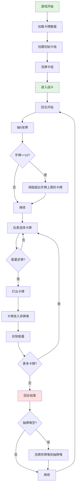
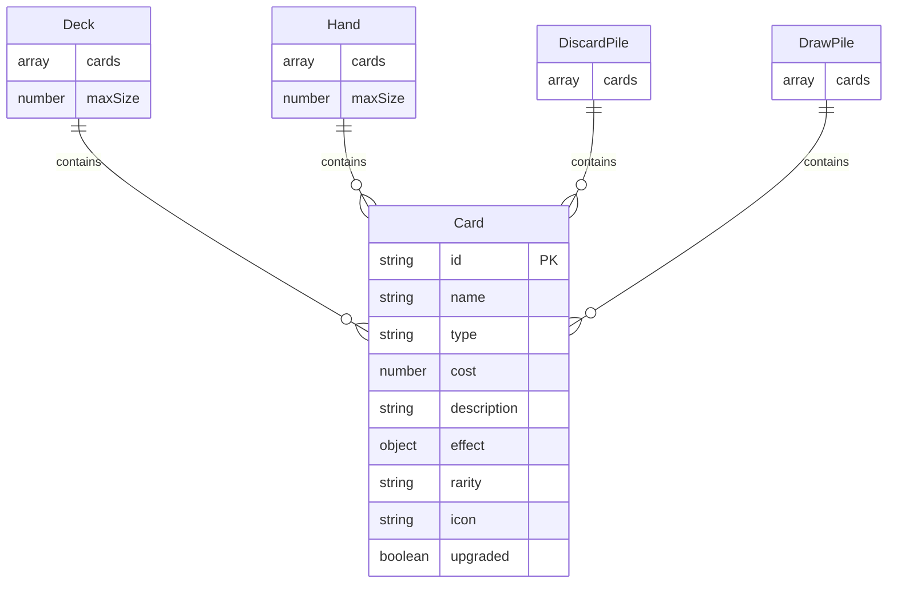

# Feature Spec: 卡牌管理系统 (CardManager)

> **版本**: 1.0
> **创建日期**: 2026-01-15
> **作者**: Spec Writer Agent
> **状态**: Draft

## Overview

### Problem Statement
卡牌策略游戏需要一个健壮的卡牌管理系统来处理卡牌数据加载、抽牌、洗牌、卡组构建等核心功能。系统需要高效管理玩家卡组、手牌、弃牌堆，确保卡牌操作的公平性和可预测性。

### Proposed Solution
实现一个 CardManager 类，负责：
- 从 JSON 文件加载所有卡牌数据
- 管理玩家卡组、手牌、弃牌堆和抽牌堆
- 提供洗牌、抽牌、弃牌等核心操作
- 验证卡牌使用条件和限制
- 支持卡牌的添加、移除和升级

## User Stories

### Story 1: 玩家构建初始卡组

```
As a 玩家,
I want to 在游戏开始时获得一套预设的初始卡组,
So that 我可以立即开始游戏而无需手动选择卡牌。
```

**Priority**: High
**Estimate**: 5

#### Acceptance Criteria

- [ ] 初始卡组包含恰好 10 张固定卡牌
- [ ] 初始卡组包含：4张攻击卡、3张防御卡、3张技能卡
- [ ] 卡组中卡牌的 ID 都是唯一且有效的
- [ ] 卡组自动保存到游戏状态中

### Story 2: 玩家每回合抽牌

```
As a 玩家,
I want to 在每回合开始时自动抽 5 张牌,
So that 我有足够的选项来制定战术。
```

**Priority**: High
**Estimate**: 8

#### Acceptance Criteria

- [ ] 回合开始时自动从抽牌堆抽取 5 张牌到手牌
- [ ] 如果抽牌堆卡牌不足，先洗牌弃牌堆再抽牌
- [ ] 如果总卡牌数不足 5 张，抽取所有剩余卡牌
- [ ] 手牌上限为 10 张，超过上限的卡牌被销毁
- [ ] 抽牌动画流畅且每张牌有明显延迟

### Story 3: 玩家打出卡牌

```
As a 玩家,
I want to 使用能量打出卡牌,
So that 我可以对敌人造成伤害或获得增益。
```

**Priority**: High
**Estimate**: 8

#### Acceptance Criteria

- [ ] 只能打出手牌中的卡牌
- [ ] 检查当前能量是否足够支付卡牌费用
- [ ] 打出卡牌后从手牌移除，进入弃牌堆
- [ ] 扣除相应的能量值
- [ ] 触发卡牌效果（由 CombatSystem 处理）
- [ ] 更新 UI 显示

### Story 4: 玩家卡组管理

```
As a 玩家,
I want to 在战斗结束后添加新卡牌到卡组,
So that 我可以不断增强卡组实力。
```

**Priority**: Medium
**Estimate**: 5

#### Acceptance Criteria

- [ ] 可以从奖励列表中选择 1 张卡牌加入卡组
- [ ] 卡组上限为 20 张卡牌
- [ ] 达到上限时无法添加新卡牌，必须先移除卡牌
- [ ] 添加卡牌后自动更新游戏状态
- [ ] 卡牌添加有明确的视觉反馈

## Requirements

### Functional Requirements

| ID | Requirement | Priority | Status |
|----|-------------|----------|--------|
| FR-001 | 系统必须从 JSON 文件加载所有可用卡牌数据 | Must | - |
| FR-002 | 系统必须支持创建初始卡组（10张固定卡牌） | Must | - |
| FR-003 | 系统必须实现 Fisher-Yates 洗牌算法 | Must | - |
| FR-004 | 系统必须从抽牌堆顶部抽取指定数量的卡牌 | Must | - |
| FR-005 | 系统必须在抽牌堆为空时自动洗牌弃牌堆 | Must | - |
| FR-006 | 系统必须验证卡牌使用条件（能量、目标等） | Must | - |
| FR-007 | 系统必须支持向卡组添加新卡牌 | Must | - |
| FR-008 | 系统必须支持从卡组移除卡牌 | Must | - |
| FR-009 | 系统必须支持卡牌升级（伤害+3或费用-1） | Should | - |
| FR-010 | 系统必须强制执行卡组上限（20张）和手牌上限（10张） | Must | - |
| FR-011 | 系统必须提供卡牌查询功能（按ID、类型、稀有度） | Should | - |

### Non-Functional Requirements

| Category | Requirement | Metric |
|----------|-------------|--------|
| Performance | 加载 500 张卡牌数据时间 | < 100ms |
| Performance | 洗牌操作时间 | < 50ms |
| Performance | 抽牌操作时间 | < 10ms per card |
| Reliability | 卡牌数据验证 | 100% valid IDs |
| Reliability | 洗牌随机性 | 通过卡方检验 |
| Maintainability | 代码模块化 | 单一职责原则 |

## Scope

### In Scope

- 卡牌数据加载和缓存
- 玩家卡组、手牌、弃牌堆、抽牌堆的管理
- 洗牌、抽牌、弃牌、添加卡牌、移除卡牌操作
- 卡牌使用条件验证
- 卡牌升级功能
- 卡牌查询和过滤

### Out of Scope

- 卡牌效果执行（由 CombatSystem 负责）
- 卡牌视觉渲染（由 GameRenderer 负责）
- 卡牌平衡性调整（游戏设计问题）
- 多人对战卡组同步
- 卡牌交易系统

## User Flow



### Step by Step

1. **游戏初始化**
   - 触发条件: 游戏启动
   - 用户操作: 无（自动）
   - 系统响应: 加载 cards.json，创建初始卡组，洗牌

2. **回合开始抽牌**
   - 触发条件: 新回合开始
   - 用户操作: 无（自动）
   - 系统响应: 从抽牌堆抽取 5 张牌，如果抽牌堆为空则先洗牌弃牌堆

3. **打出卡牌**
   - 触发条件: 玩家点击手牌中的卡牌
   - 用户操作: 选择要打出的卡牌
   - 系统响应: 验证能量，移除手牌，加入弃牌堆，扣除能量，触发效果

4. **卡组管理**
   - 触发条件: 战斗胜利进入奖励界面
   - 用户操作: 从 3 张卡牌中选择 1 张
   - 系统响应: 验证卡组上限，添加卡牌到卡组，更新存档

## UI/UX Requirements

### Screens

| Screen | Description | Mockup Link |
|--------|-------------|-------------|
| 卡牌选择界面 | 显示 3 张随机卡牌供玩家选择 | docs/mockups/card-selection.md |
| 卡组查看界面 | 显示当前卡组所有卡牌 | docs/mockups/deck-view.md |

### Interactions

| Element | Interaction | Behavior |
|---------|-------------|----------|
| 卡牌 | 悬停 | 显示卡牌详细信息（放大的卡牌图像） |
| 卡牌 | 点击 | 尝试打出卡牌（检查能量） |
| 卡牌 | 拖拽 | 拖拽到目标区域确认打出 |
| 卡组 | 点击 | 打开卡组查看界面 |
| 抽牌动画 | 自动 | 卡牌从抽牌堆飞到手牌位置 |

## Data Model

### Entities



### Data Fields

| Field | Type | Required | Constraints | Description |
|-------|------|----------|-------------|-------------|
| id | string | Yes | Format: "card_XXX", unique | 卡牌唯一标识符 |
| name | string | Yes | Length: 1-30 chars | 卡牌名称 |
| type | string | Yes | Values: attack/defense/skill/status | 卡牌类型 |
| cost | number | Yes | Range: 0-3 | 能量费用 |
| description | string | Yes | Length: 1-100 chars | 卡牌效果描述 |
| effect | object | Yes | Valid effect structure | 卡牌效果定义 |
| rarity | string | Yes | Values: common/rare/epic/legendary | 卡牌稀有度 |
| icon | string | Yes | Valid emoji or icon code | 卡牌图标 |
| upgraded | boolean | No | Default: false | 是否已升级 |

## API Requirements

### Public Methods

| Method | Parameters | Returns | Description |
|--------|------------|---------|-------------|
| `loadCards()` | - | Promise<void> | 从 JSON 加载所有卡牌数据 |
| `createStarterDeck()` | - | Card[] | 创建并返回初始卡组 |
| `shuffleDeck(deck)` | Card[] | Card[] | 洗牌并返回 |
| `drawCards(count)` | number | Card[] | 从抽牌堆抽取指定数量卡牌 |
| `playCard(cardId)` | string | Promise<boolean> | 打出指定卡牌 |
| `addCardToDeck(cardId)` | string | Promise<boolean> | 添加卡牌到卡组 |
| `removeCardFromDeck(cardId)` | string | Promise<boolean> | 从卡组移除卡牌 |
| `upgradeCard(cardId)` | string | Promise<boolean> | 升级指定卡牌 |
| `getCardsByType(type)` | string | Card[] | 按类型查询卡牌 |
| `reshuffleDiscardToDraw()` | - | void | 将弃牌堆洗牌到抽牌堆 |

## Dependencies

| Dependency | Type | Status | Notes |
|------------|------|--------|-------|
| cards.json | Internal | Required | 卡牌数据文件 |
| GameState | Internal | Required | 游戏状态管理 |
| CombatSystem | Internal | Required | 执行卡牌效果 |
| GameRenderer | Internal | Required | 渲染卡牌和动画 |

## Implementation Plan

### Phases

#### Phase 1: 核心数据结构

**Goal**: 建立卡牌数据基础

| Task | Estimate | Owner | Status |
|------|----------|-------|--------|
| 设计 Card 数据结构 | 2h | - | - |
| 创建 cards.json 文件 | 3h | - | - |
| 实现 loadCards 方法 | 2h | - | - |
| 编写数据验证测试 | 2h | - | - |

#### Phase 2: 卡组管理

**Goal**: 实现卡组基本操作

| Task | Estimate | Owner | Status |
|------|----------|-------|--------|
| 实现洗牌算法 | 2h | - | - |
| 实现抽牌逻辑 | 3h | - | - |
| 实现弃牌逻辑 | 1h | - | - |
| 实现卡组上限验证 | 2h | - | - |

#### Phase 3: 卡牌操作

**Goal**: 实现卡牌使用功能

| Task | Estimate | Owner | Status |
|------|----------|-------|--------|
| 实现打出卡牌流程 | 4h | - | - |
| 实现能量验证 | 2h | - | - |
| 实现卡牌添加/移除 | 3h | - | - |
| 实现卡牌升级系统 | 3h | - | - |

#### Phase 4: 集成与测试

**Goal**: 完整集成和测试

| Task | Estimate | Owner | Status |
|------|----------|-------|--------|
| 与 CombatSystem 集成 | 4h | - | - |
| 与 GameRenderer 集成 | 3h | - | - |
| 编写单元测试 | 6h | - | - |
| 编写集成测试 | 4h | - | - |

## Testing Strategy

### Test Types

- [x] Unit Tests
- [ ] Integration Tests
- [ ] E2E Tests
- [ ] Performance Tests
- [ ] Security Tests

### Test Cases

| ID | Scenario | Expected Result | Status |
|----|----------|-----------------|--------|
| TC-001 | 加载有效卡牌数据 | 成功加载所有卡牌，无错误 | - |
| TC-002 | 加载无效的 cards.json | 抛出明确的错误异常 | - |
| TC-003 | 洗牌后卡牌顺序 | 卡牌顺序完全随机，通过随机性测试 | - |
| TC-004 | 从空抽牌堆抽牌 | 自动洗牌弃牌堆到抽牌堆，然后抽牌 | - |
| TC-005 | 从空抽牌堆和空弃牌堆抽牌 | 返回空数组或剩余卡牌 | - |
| TC-006 | 抽牌超过抽牌堆数量 | 返回所有剩余卡牌 | - |
| TC-007 | 手牌达到10张上限 | 第11张牌被销毁，显示警告 | - |
| TC-008 | 打出能量不足的卡牌 | 返回 false，显示错误提示 | - |
| TC-009 | 打出不存在的卡牌ID | 抛出异常，返回 false | - |
| TC-010 | 添加卡牌到满额卡组 | 返回 false，显示"卡组已满"提示 | - |
| TC-011 | 移除卡组中不存在的卡牌 | 返回 false | - |
| TC-012 | 升级已升级的卡牌 | 返回 false 或保持不变 | - |
| TC-013 | 查询不存在的卡牌类型 | 返回空数组 | - |
| TC-014 | 创建初始卡组 | 返回恰好10张卡，类型分布正确 | - |

### Edge Cases

| ID | Edge Case | Expected Behavior |
|----|-----------|-------------------|
| EC-001 | cards.json 文件不存在 | 抛出 FileNotFoundError |
| EC-002 | cards.json 包含重复的卡牌ID | 跳过重复卡牌或抛出警告 |
| EC-003 | 卡牌缺少必需字段 | 跳过无效卡牌，记录警告 |
| EC-004 | 抽牌数量为0 | 返回空数组，不抛出错误 |
| EC-005 | 抽牌数量为负数 | 抛出 InvalidArgumentException |
| EC-006 | 卡牌cost为负数 | 数据验证时标记为无效 |
| EC-007 | 同时添加多张相同ID卡牌 | 允许（卡牌可有多张副本） |

## Business Rules

### BR-001: 卡组构成规则
- 初始卡组必须包含恰好 10 张卡牌
- 卡牌类型分布：4张攻击卡、3张防御卡、3张技能卡
- 卡组中同一卡牌最多可有 3 张副本

### BR-002: 抽牌规则
- 每回合开始时自动抽 5 张牌
- 手牌上限为 10 张
- 超过上限的卡牌被直接销毁（不进入弃牌堆）
- 抽牌堆为空时自动洗牌弃牌堆到抽牌堆

### BR-003: 打出卡牌规则
- 只能打出手牌中的卡牌
- 当前能量必须 >= 卡牌费用
- 打出后卡牌进入弃牌堆
- 扣除相应的能量值

### BR-004: 卡组管理规则
- 卡组上限为 20 张卡牌
- 达到上限时必须移除卡牌才能添加新卡牌
- 战斗结束后可选择添加 1 张新卡牌

### BR-005: 卡牌升级规则
- 只有在特定地点（休息点）可以升级卡牌
- 每次升级可以选择：伤害+3 或 费用-1（最低为0）
- 已升级的卡牌无法再次升级

## Error Handling

| Error Code | Error Message | Cause | Resolution |
|------------|---------------|-------|------------|
| ERR_CARDS_NOT_FOUND | "卡牌数据文件未找到" | cards.json 不存在 | 检查文件路径，重新创建 |
| ERR_CARD_INVALID | "卡牌数据无效: {cardId}" | 卡牌缺少必需字段 | 修复 cards.json 数据 |
| ERR_DECK_FULL | "卡组已满（20/20），请先移除卡牌" | 尝试添加卡牌到满额卡组 | 移除不需要的卡牌 |
| ERR_HAND_FULL | "手牌已满，卡牌已销毁" | 手牌达10张上限 | 信息提示，销毁超出的卡牌 |
| ERR_INSUFFICIENT_ENERGY | "能量不足（需要 {cost}，当前 {energy}）" | 尝试打出费用过高的卡牌 | 提示玩家，阻止操作 |
| ERR_CARD_NOT_IN_HAND | "卡牌不在手牌中" | 尝试打出不在手牌的卡牌 | 检查卡牌状态 |
| ERR_CARD_NOT_FOUND | "未找到卡牌: {cardId}" | 查询不存在的卡牌ID | 验证卡牌ID |

## Risks & Mitigations

| Risk | Probability | Impact | Mitigation Strategy |
|------|-------------|--------|---------------------|
| cards.json 数据损坏 | Medium | High | 实现数据验证和备份机制 |
| 洗牌算法不公平 | Low | High | 使用经过验证的 Fisher-Yates 算法 |
| 抽牌性能问题（卡组过大） | Low | Medium | 限制卡组上限为20张 |
| 卡牌ID冲突 | Medium | Medium | 实施ID唯一性验证 |
| 内存泄漏（大量卡牌对象） | Low | Medium | 使用对象池或定期清理 |

## Success Metrics

| Metric | Target | How to Measure |
|--------|--------|----------------|
| 卡牌加载成功率 | 100% | 单元测试通过率 |
| 洗牌随机性质量 | p > 0.05 | 卡方检验 |
| 抽牌操作响应时间 | < 10ms | 性能测试 |
| 卡牌验证覆盖率 | 100% | 代码覆盖率工具 |
| 零运行时错误 | 0 errors | 错误监控日志 |

## Rollout Plan

### Stages

1. **Alpha**: 内部测试和核心功能验证 (Week 1-2)
2. **Beta**: 有限玩家测试，收集反馈 (Week 3-4)
3. **GA**: 正式发布，完整功能可用 (Week 5)

### Feature Flags

| Flag | Description | Default |
|------|-------------|---------|
| `enableCardUpgrade` | 启用卡牌升级功能 | true |
| `strictCardValidation` | 严格验证卡牌数据 | true |
| `limitDeckSize` | 强制执行卡组上限 | true |

## Monitoring & Alerting

### Metrics to Track

- 卡牌加载失败次数
- 洗牌操作平均耗时
- 抽牌操作平均耗时
- 卡牌验证失败率
- 手牌/卡组上限触发频率

### Alert Conditions

| Condition | Severity | Action |
|-----------|----------|--------|
| 卡牌加载失败率 > 0% | Critical | 立即检查 cards.json 文件 |
| 洗牌耗时 > 100ms | Warning | 性能分析 |
| 抽牌操作失败 | Critical | 检查抽牌堆状态 |

## Changelog

| Version | Date | Changes | Author |
|---------|------|---------|--------|
| 1.0 | 2026-01-15 | 初始版本 | Spec Writer Agent |
