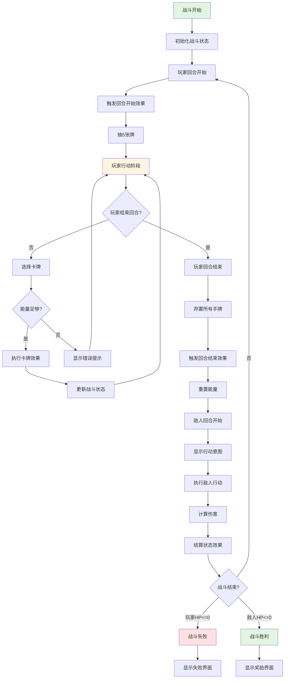
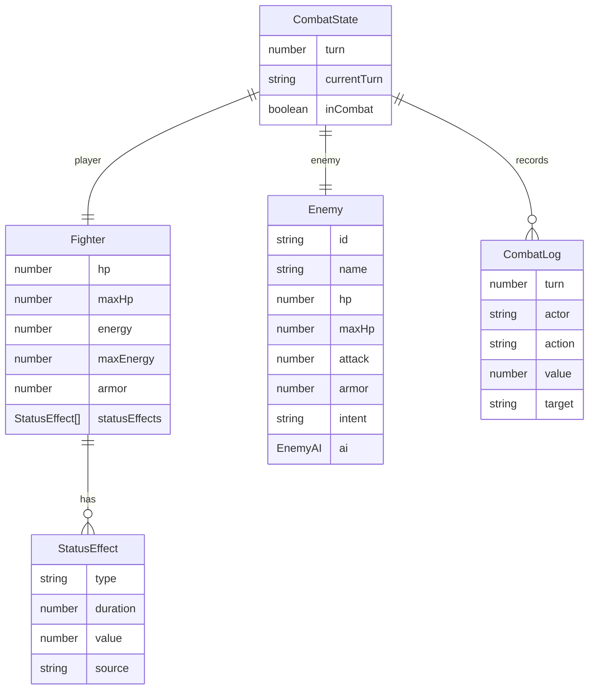

# Feature Spec: 战斗系统 (CombatSystem)

> **版本**: 1.0
> **创建日期**: 2026-01-15
> **作者**: Spec Writer Agent
> **状态**: Draft

## Overview

### Problem Statement
卡牌策略游戏需要一个完整的回合制战斗系统来处理玩家和敌人之间的战斗交互。系统需要管理回合流程、执行卡牌效果、计算伤害、处理状态效果，并提供流畅的战斗体验。

### Proposed Solution
实现一个 CombatSystem 类，负责：
- 管理战斗回合流程（玩家回合、敌人回合）
- 执行卡牌效果（伤害、防御、技能、状态）
- 计算和结算伤害
- 管理状态效果（中毒、燃烧、虚弱等）
- 处理敌人AI和意图系统
- 判定战斗胜负

## User Stories

### Story 1: 玩家执行回合

```
As a 玩家,
I want to 在我的回合内使用卡牌攻击敌人或防御自己,
So that 我可以击败敌人或减少受到的伤害。
```

**Priority**: High
**Estimate**: 8

#### Acceptance Criteria

- [ ] 回合开始时触发所有"回合开始"效果
- [ ] 自动抽 5 张牌
- [ ] 玩家可以使用能量打出卡牌
- [ ] 每张卡牌的效果正确执行
- [ ] 回合结束时触发所有"回合结束"效果
- [ ] 未使用的卡牌进入弃牌堆
- [ ] 能量在回合结束时重置

### Story 2: 敌人执行回合

```
As a 玩家,
I want to 敌人在它的回合执行预设的攻击或技能,
So that 我需要预测敌人的行动并制定防御策略。
```

**Priority**: High
**Estimate**: 8

#### Acceptance Criteria

- [ ] 敌人回合开始时显示行动意图
- [ ] 敌人根据意图执行行动（攻击、防御、技能）
- [ ] 敌人的伤害和效果正确计算
- [ ] 状态效果在敌人回合结算
- [ ] 敌人能量/行动点正确消耗

### Story 3: 伤害计算与结算

```
As a 玩家,
I want to 攻击时看到正确的伤害计算（考虑护甲、状态效果）,
So that 我可以准确预测战斗结果。
```

**Priority**: High
**Estimate**: 5

#### Acceptance Criteria

- [ ] 伤害计算公式：最终伤害 = (基础伤害 + 加成) × 倍率 - 护甲
- [ ] 最小伤害为 1（至少造成 1 点伤害）
- [ ] 护甲可以抵挡伤害
- [ ] 易伤状态增加 50% 受到的伤害
- [ ] 虚弱状态减少 25% 造成的伤害
- [ ] 伤害数字正确显示并有动画效果

### Story 4: 状态效果管理

```
As a 玩家,
I want to 给敌人施加状态效果（中毒、燃烧等）,
So that 我可以在多个回合内持续造成伤害或削弱敌人。
```

**Priority**: Medium
**Estimate**: 6

#### Acceptance Criteria

- [ ] 状态效果可以施加到玩家或敌人
- [ ] 每种状态有明确的持续回合数
- [ ] 状态效果在回合开始或结束时结算
- [ ] 持续回合数递减
- [ ] 持续回合数为 0 时移除状态
- [ ] 相同状态叠加时刷新持续时间或增强效果

### Story 5: 战斗胜负判定

```
As a 玩家,
I want to 击败敌人后获得奖励或生命归零时游戏结束,
So that 我有明确的战斗目标和结果。
```

**Priority**: High
**Estimate**: 5

#### Acceptance Criteria

- [ ] 敌人生命值 <= 0 时判定胜利
- [ ] 玩家生命值 <= 0 时判定失败
- [ ] 胜利后显示奖励界面
- [ ] 失败后显示游戏结束界面
- [ ] 战斗结束后触发结算逻辑

## Requirements

### Functional Requirements

| ID | Requirement | Priority | Status |
|----|-------------|----------|--------|
| FR-001 | 系统必须实现完整的玩家回合流程 | Must | - |
| FR-002 | 系统必须实现完整的敌人回合流程 | Must | - |
| FR-003 | 系统必须执行所有类型的卡牌效果 | Must | - |
| FR-004 | 系统必须正确计算伤害（考虑护甲、状态） | Must | - |
| FR-005 | 系统必须管理所有状态效果的持续和结算 | Must | - |
| FR-006 | 系统必须显示敌人下回合的行动意图 | Must | - |
| FR-007 | 系统必须实现基本的敌人AI | Must | - |
| FR-008 | 系统必须判定战斗胜负并触发相应逻辑 | Must | - |
| FR-009 | 系统必须支持连击系统（同类型卡牌加成） | Should | - |
| FR-010 | 系统必须记录战斗日志供玩家查看 | Should | - |

### Non-Functional Requirements

| Category | Requirement | Metric |
|----------|-------------|--------|
| Performance | 单次卡牌效果执行时间 | < 50ms |
| Performance | 伤害计算时间 | < 10ms |
| Performance | 回合切换时间 | < 100ms |
| Reliability | 战斗状态一致性 | 100% |
| Maintainability | 代码模块化 | 每个效果独立函数 |
| Usability | 战斗动画流畅度 | 60 FPS |

## Scope

### In Scope

- 完整的回合制战斗流程
- 所有卡牌效果的执行
- 伤害计算和结算
- 状态效果管理（中毒、燃烧、虚弱、易伤、缴械）
- 敌人AI和意图系统
- 战斗胜负判定
- 战斗日志记录
- 连击系统

### Out of Scope

- 多敌人战斗（后续版本）
- 玩家对战（PVP）
- 复杂的敌人AI（学习玩家行为）
- 战斗回放功能
- 实时战斗（回合制的替代）

## User Flow



### Step by Step

1. **战斗初始化**
   - 触发条件: 进入战斗场景
   - 用户操作: 无（自动）
   - 系统响应: 初始化玩家和敌人状态，加载卡组，开始玩家回合

2. **玩家回合**
   - 触发条件: 回合开始
   - 用户操作: 选择并打出卡牌，或点击结束回合
   - 系统响应: 抽牌，执行卡牌效果，更新战斗状态

3. **敌人回合**
   - 触发条件: 玩家回合结束
   - 用户操作: 无（自动）
   - 系统响应: 显示意图，执行敌人行动，结算伤害和状态效果

4. **战斗结束**
   - 触发条件: 任一方生命值 <= 0
   - 用户操作: 无（自动）
   - 系统响应: 判定胜负，显示结算界面，触发奖励逻辑

## UI/UX Requirements

### Screens

| Screen | Description | Mockup Link |
|--------|-------------|-------------|
| 战斗界面 | 显示玩家、敌人、手牌、能量等 | docs/mockups/combat-screen.md |
| 战斗日志 | 显示战斗过程中的所有事件 | docs/mockups/combat-log.md |

### Interactions

| Element | Interaction | Behavior |
|---------|-------------|----------|
| 卡牌 | 拖拽到敌人 | 尝试攻击敌人 |
| 卡牌 | 拖拽到自己 | 施放防御/增益效果 |
| 结束回合按钮 | 点击 | 立即结束当前回合 |
| 敌人意图图标 | 悬停 | 显示详细说明 |
| 伤害数字 | 自动 | 飘动动画效果 |

## Data Model

### Entities



### Data Fields

| Field | Type | Required | Constraints | Description |
|-------|------|----------|-------------|-------------|
| turn | number | Yes | Min: 1 | 当前回合数 |
| currentTurn | string | Yes | Values: player/enemy | 当前行动方 |
| inCombat | boolean | Yes | - | 是否在战斗中 |
| hp | number | Yes | Min: 0, Max: maxHp | 当前生命值 |
| maxHp | number | Yes | Min: 1 | 最大生命值 |
| energy | number | Yes | Min: 0, Max: 3 | 当前能量 |
| armor | number | Yes | Min: 0 | 当前护甲值 |
| statusType | string | Yes | poison/burn/weak/vulnerable/disarm | 状态类型 |
| duration | number | Yes | Min: 0 | 持续回合数 |
| intent | string | Yes | attack/defend/skill | 敌人意图 |

## API Requirements

### Public Methods

| Method | Parameters | Returns | Description |
|--------|------------|---------|-------------|
| `startCombat(enemyId)` | string | Promise<void> | 开始与指定敌人的战斗 |
| `endPlayerTurn()` | - | void | 结束玩家回合 |
| `playCard(cardId, target)` | string, string | Promise<boolean> | 打出卡牌到目标 |
| `executeCardEffect(card, target)` | Card, string | Promise<void> | 执行卡牌效果 |
| `calculateDamage(baseDamage, attacker, defender)` | number, Fighter, Fighter | number | 计算最终伤害 |
| `applyStatusEffect(target, type, duration, value)` | Fighter, string, number, number | void | 施加状态效果 |
| `processStatusEffects(fighter)` | Fighter | void | 结算状态效果 |
| `enemyTurn()` | - | Promise<void> | 执行敌人回合 |
| `checkBattleEnd()` | - | string | 检查战斗是否结束（victory/defeat/continue） |
| `addCombatLog(message)` | string | void | 添加战斗日志 |

## Dependencies

| Dependency | Type | Status | Notes |
|------------|------|--------|-------|
| CardManager | Internal | Required | 提供卡牌数据和操作 |
| GameState | Internal | Required | 保存和加载战斗状态 |
| GameRenderer | Internal | Required | 渲染战斗界面和动画 |
| LevelManager | Internal | Required | 提供敌人数据 |

## Implementation Plan

### Phases

#### Phase 1: 战斗状态管理

**Goal**: 建立战斗数据结构

| Task | Estimate | Owner | Status |
|------|----------|-------|--------|
| 设计战斗数据模型 | 3h | - | - |
| 实现战斗状态初始化 | 2h | - | - |
| 实现回合切换逻辑 | 3h | - | - |
| 编写状态管理测试 | 2h | - | - |

#### Phase 2: 卡牌效果执行

**Goal**: 实现所有卡牌效果

| Task | Estimate | Owner | Status |
|------|----------|-------|--------|
| 实现攻击卡效果 | 3h | - | - |
| 实现防御卡效果 | 2h | - | - |
| 实现技能卡效果 | 4h | - | - |
| 实现状态卡效果 | 3h | - | - |
| 编写效果测试 | 3h | - | - |

#### Phase 3: 伤害与状态系统

**Goal**: 完善伤害计算和状态管理

| Task | Estimate | Owner | Status |
|------|----------|-------|--------|
| 实现伤害计算逻辑 | 3h | - | - |
| 实现护甲系统 | 2h | - | - |
| 实现状态效果施加 | 3h | - | - |
| 实现状态效果结算 | 3h | - | - |
| 编写伤害和状态测试 | 3h | - | - |

#### Phase 4: 敌人AI与战斗流程

**Goal**: 完整战斗体验

| Task | Estimate | Owner | Status |
|------|----------|-------|--------|
| 实现敌人意图系统 | 3h | - | - |
| 实现基础敌人AI | 4h | - | - |
| 实现战斗胜负判定 | 2h | - | - |
| 实现战斗日志 | 2h | - | - |
| 集成测试 | 4h | - | - |

## Testing Strategy

### Test Types

- [x] Unit Tests
- [x] Integration Tests
- [ ] E2E Tests
- [ ] Performance Tests
- [ ] Security Tests

### Test Cases

| ID | Scenario | Expected Result | Status |
|----|----------|-----------------|--------|
| TC-001 | 玩家回合开始 | 抽5张牌，能量重置为3 | - |
| TC-002 | 打出攻击卡 | 敌人受到正确伤害，卡牌进入弃牌堆 | - |
| TC-003 | 打出防御卡 | 玩家获得护甲，能量减少 | - |
| TC-004 | 能量不足时打牌 | 返回false，显示错误提示 | - |
| TC-005 | 计算伤害（有护甲） | 护甲抵消伤害，最小伤害为1 | - |
| TC-006 | 计算伤害（有易伤） | 伤害增加50% | - |
| TC-007 | 计算伤害（有虚弱） | 伤害减少25% | - |
| TC-008 | 施加中毒状态 | 敌人每回合失去3点生命，持续3回合 | - |
| TC-009 | 施加燃烧状态 | 敌人每回合失去5%生命，持续2回合 | - |
| TC-010 | 状态效果持续时间 | 每回合递减，为0时移除 | - |
| TC-011 | 敌人执行攻击 | 玩家受到伤害，护甲抵消 | - |
| TC-012 | 敌人意图显示 | 显示正确的意图图标和数值 | - |
| TC-013 | 战斗胜利 | 敌人HP<=0，显示奖励界面 | - |
| TC-014 | 战斗失败 | 玩家HP<=0，显示失败界面 | - |
| TC-015 | 连击系统 | 连续使用同类型卡牌获得加成 | - |

### Edge Cases

| ID | Edge Case | Expected Behavior |
|----|-----------|-------------------|
| EC-001 | 同时施加相同状态效果 | 刷新持续时间或叠加效果 |
| EC-002 | 伤害计算结果为负 | 最小伤害为1 |
| EC-003 | 状态效果在战斗外仍然存在 | 战斗结束后清除所有状态 |
| EC-004 | 敌人AI无可用行动 | 执行默认攻击 |
| EC-005 | 回合结束时手牌已满 | 强制弃置所有手牌 |

## Business Rules

### BR-001: 回合流程规则
- 玩家回合和敌人回合交替进行
- 每回合开始时触发"回合开始"效果
- 每回合结束时触发"回合结束"效果
- 玩家可以手动结束回合

### BR-002: 能量规则
- 每回合开始时能量恢复为3点
- 打出卡牌消耗对应能量
- 回合结束时未使用的能量不保留
- 特殊效果可以临时增加能量上限

### BR-003: 伤害计算规则
- 最终伤害 = (基础伤害 + 加成) × 倍率 - 护甲
- 最小伤害为 1
- 易伤增加 50% 受到的伤害
- 虚弱减少 25% 造成的伤害

### BR-004: 状态效果规则
- 状态效果有明确的持续回合数
- 每回合开始或结束时结算状态效果
- 持续回合数为0时移除状态
- 相同状态可能叠加或刷新

### BR-005: 战斗结束规则
- 敌人HP <= 0 时战斗胜利
- 玩家HP <= 0 时战斗失败
- 同时满足时玩家优先失败
- 战斗结束后触发相应奖励逻辑

## Error Handling

| Error Code | Error Message | Cause | Resolution |
|------------|---------------|-------|------------|
| ERR_INVALID_TARGET | "无效的目标" | 目标不存在或不可选 | 检查目标有效性 |
| ERR_INSUFFICIENT_ENERGY | "能量不足" | 能量不足以支付卡牌费用 | 提示玩家，阻止操作 |
| ERR_CARD_NOT_PLAYABLE | "卡牌现在无法使用" | 卡牌使用条件不满足 | 检查卡牌使用条件 |
| ERR_COMBAT_NOT_INITIALIZED | "战斗未初始化" | 在战斗外尝试战斗操作 | 检查战斗状态 |
| ERR_INVALID_EFFECT | "无效的卡牌效果" | 卡牌效果定义错误 | 修复卡牌数据 |

## Risks & Mitigations

| Risk | Probability | Impact | Mitigation Strategy |
|------|-------------|--------|---------------------|
| 伤害计算错误 | Medium | High | 完善单元测试，验证所有情况 |
| 状态效果叠加冲突 | Medium | Medium | 定义明确的叠加规则 |
| 战斗循环永不结束 | Low | Critical | 添加最大回合限制（50回合） |
| 性能问题（大量状态效果） | Low | Medium | 优化状态效果结算逻辑 |
| AI决策过于简单 | Medium | Low | 后续版本增强AI |

## Success Metrics

| Metric | Target | How to Measure |
|--------|--------|----------------|
| 战斗胜利平衡性 | 45-55% | 统计玩家胜率 |
| 平均战斗时长 | 3-5分钟 | 战斗日志时间戳 |
| 战斗崩溃率 | < 0.1% | 错误监控 |
| 伤害计算准确率 | 100% | 单元测试 |

## Rollout Plan

### Stages

1. **Alpha**: 核心战斗功能实现 (Week 1-2)
2. **Beta**: 增加连击系统和高级AI (Week 3-4)
3. **GA**: 平衡性调整和优化 (Week 5)

### Feature Flags

| Flag | Description | Default |
|------|-------------|---------|
| `enableComboSystem` | 启用连击系统 | true |
| `enableAdvancedAI` | 启用高级敌人AI | false |
| `combatLogEnabled` | 启用战斗日志 | true |

## Monitoring & Alerting

### Metrics to Track

- 平均战斗时长
- 玩家胜率（按敌人类型）
- 最常用卡牌
- 战斗崩溃率
- 回合数分布

### Alert Conditions

| Condition | Severity | Action |
|-----------|----------|--------|
| 战斗崩溃率 > 1% | Critical | 立即修复 |
| 平均战斗时长 > 10分钟 | Warning | 检查平衡性 |
| 胜率 < 30% 或 > 70% | Warning | 调整难度 |

## Changelog

| Version | Date | Changes | Author |
|---------|------|---------|--------|
| 1.0 | 2026-01-15 | 初始版本 | Spec Writer Agent |
