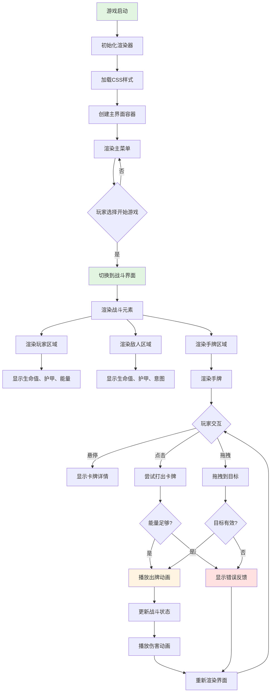
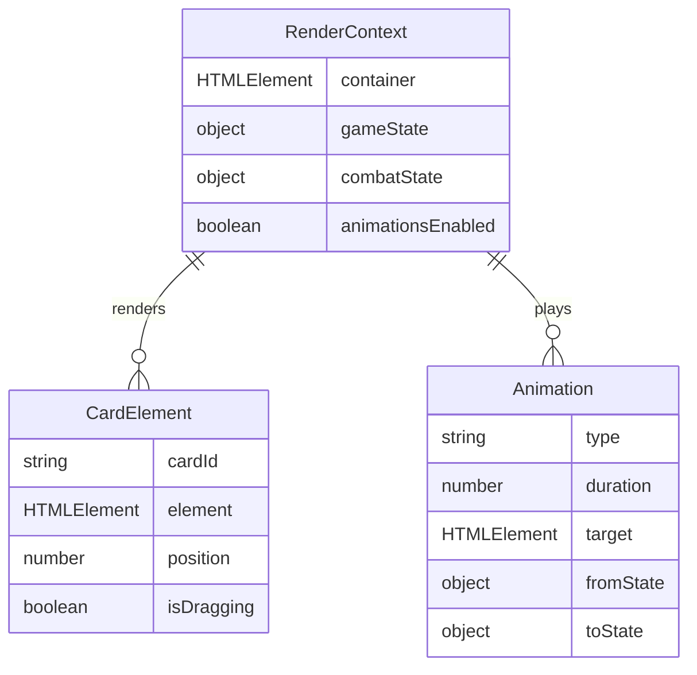

# Feature Spec: UI渲染器 (GameRenderer)

> **版本**: 1.0
> **创建日期**: 2026-01-15
> **作者**: Spec Writer Agent
> **状态**: Draft

## Overview

### Problem Statement
卡牌策略游戏需要一个完整的UI渲染系统来可视化游戏状态、卡牌、战斗界面和动画效果。系统需要提供流畅的视觉体验，同时保持代码简洁且不依赖外部框架。

### Proposed Solution
实现一个 GameRenderer 类，负责：
- 渲染卡牌（手牌、卡组、弃牌堆）
- 渲染战斗界面（玩家、敌人、状态条）
- 渲染能量和回合信息
- 实现卡牌和战斗动画
- 响应用户交互事件
- 提供视觉反馈和提示信息

## User Stories

### Story 1: 渲染卡牌界面

```
As a 玩家,
I want to 清晰地看到我的手牌、能量和卡组信息,
So that 我可以做出明智的战术决策。
```

**Priority**: High
**Estimate**: 8

#### Acceptance Criteria

- [ ] 手牌区域显示当前所有手牌
- [ ] 每张卡牌显示：图标、名称、费用、描述
- [ ] 能量不足的卡牌显示为灰色/不可点击
- [ ] 悬停时显示卡牌详细信息（放大效果）
- [ ] 手牌区域支持滚动（超过5张牌时）
- [ ] 卡牌使用有流畅的动画效果

### Story 2: 渲染战斗界面

```
As a 玩家,
I want to 看到清晰的战斗界面，包括玩家、敌人、生命值、护甲等,
So that 我可以实时了解战斗状态。
```

**Priority**: High
**Estimate**: 8

#### Acceptance Criteria

- [ ] 玩家区域显示：头像、生命值条、护甲值、能量
- [ ] 敌人区域显示：头像、生命值条、护甲值、意图图标
- [ ] 生命值条使用颜色渐变（绿色->黄色->红色）
- [ ] 状态效果（中毒、虚弱等）显示为图标
- [ ] 伤害数字有飘动动画效果
- [ ] 护甲变化有视觉反馈

### Story 3: 卡牌动画效果

```
As a 玩家,
I want to 看到流畅的卡牌动画（抽牌、出牌、洗牌）,
So that 游戏体验更加生动有趣。
```

**Priority**: Medium
**Estimate**: 6

#### Acceptance Criteria

- [ ] 抽牌动画：卡牌从抽牌堆飞到手牌
- [ ] 出牌动画：卡牌从手牌飞向目标
- [ ] 弃牌动画：卡牌从手牌飞向弃牌堆
- [ ] 洗牌动画：弃牌堆翻转并移动到抽牌堆
- [ ] 伤害数字动画：从目标身上飘起并消失
- [ ] 动画时长在300-500ms之间
- [ ] 动画可禁用（性能选项）

### Story 4: 响应用户交互

```
As a 玩家,
I want to 通过点击或拖拽来操作卡牌,
So that 游戏操作直观且符合直觉。
```

**Priority**: High
**Estimate**: 5

#### Acceptance Criteria

- [ ] 支持点击卡牌来打出
- [ ] 支持拖拽卡牌到目标
- [ ] 拖拽时显示目标高亮
- [ ] 无效操作有视觉反馈（晃动、红色提示）
- [ ] 结束回合按钮明显且易点击
- [ ] 卡组图标显示剩余卡牌数量

## Requirements

### Functional Requirements

| ID | Requirement | Priority | Status |
|----|-------------|----------|--------|
| FR-001 | 系统必须渲染所有卡牌元素（手牌、卡组、弃牌堆） | Must | - |
| FR-002 | 系统必须渲染战斗界面（玩家、敌人、状态条） | Must | - |
| FR-003 | 系统必须实现卡牌动画（抽牌、出牌、弃牌） | Must | - |
| FR-004 | 系统必须实现伤害数字动画 | Must | - |
| FR-005 | 系统必须响应鼠标点击和拖拽事件 | Must | - |
| FR-006 | 系统必须显示敌人意图图标 | Must | - |
| FR-007 | 系统必须显示状态效果图标 | Should | - |
| FR-008 | 系统必须提供视觉反馈（错误、成功、警告） | Should | - |
| FR-009 | 系统必须支持响应式布局 | Should | - |
| FR-010 | 系统必须支持禁用动画以提高性能 | Could | - |

### Non-Functional Requirements

| Category | Requirement | Metric |
|----------|-------------|--------|
| Performance | UI渲染帧率 | 60 FPS |
| Performance | 动画延迟 | < 20ms |
| Usability | 响应时间 | < 100ms |
| Maintainability | 代码模块化 | 单一职责原则 |
| Compatibility | 浏览器支持 | Chrome/Firefox/Edge/Safari |

## Scope

### In Scope

- 卡牌渲染（手牌、卡组、弃牌堆、抽牌堆）
- 战斗界面渲染（玩家、敌人、状态条）
- 能量和回合信息显示
- 卡牌动画（抽牌、出牌、弃牌、洗牌）
- 伤害数字动画
- 状态效果图标显示
- 用户交互事件处理
- 视觉反馈和提示

### Out of Scope

- 复杂的3D效果
- 粒子系统
- 声音效果（由AudioManager负责）
- 网络多人界面
- 自定义UI主题
- 移动端手势优化

## User Flow



### Step by Step

1. **初始化渲染器**
   - 触发条件: 游戏启动
   - 用户操作: 无（自动）
   - 系统响应: 加载CSS，创建DOM结构，初始化事件监听器

2. **渲染战斗界面**
   - 触发条件: 进入战斗
   - 用户操作: 无（自动）
   - 系统响应: 创建玩家区域、敌人区域、手牌区域

3. **渲染手牌**
   - 触发条件: 抽牌或手牌变化
   - 用户操作: 无（自动）
   - 系统响应: 清空手牌区域，渲染每张卡牌

4. **处理卡牌点击**
   - 触发条件: 玩家点击卡牌
   - 用户操作: 点击卡牌
   - 系统响应: 验证能量，播放动画，更新状态

## UI/UX Requirements

### Screens

| Screen | Description | Mockup Link |
|--------|-------------|-------------|
| 战斗界面 | 主战斗区域，包含玩家、敌人、手牌 | docs/mockups/combat-screen.md |
| 卡牌详情 | 卡牌放大显示的弹窗 | docs/mockups/card-detail.md |
| 战斗结果 | 胜利/失败的结算界面 | docs/mockups/battle-result.md |

### Interactions

| Element | Interaction | Behavior |
|---------|-------------|----------|
| 卡牌 | 悬停 | 显示放大的卡牌详情（鼠标附近） |
| 卡牌 | 点击 | 尝试打出卡牌 |
| 卡牌 | 拖拽开始 | 高亮可用的目标 |
| 卡牌 | 拖拽释放 | 如果目标有效则打出卡牌 |
| 敌人 | 悬停 | 显示敌人详细状态 |
| 结束回合按钮 | 点击 | 立即结束玩家回合 |
| 卡组图标 | 点击 | 显示卡组内容 |

## Data Model

### Entities



### Data Fields

| Field | Type | Required | Constraints | Description |
|-------|------|----------|-------------|-------------|
| container | HTMLElement | Yes | - | 主界面容器 |
| gameState | object | Yes | Valid state | 当前游戏状态 |
| combatState | object | Yes | Valid state | 当前战斗状态 |
| animationsEnabled | boolean | No | Default: true | 是否启用动画 |
| animationSpeed | number | No | Range: 0.5-2.0 | 动画速度倍率 |

## API Requirements

### Public Methods

| Method | Parameters | Returns | Description |
|--------|------------|---------|-------------|
| `init(container)` | HTMLElement | void | 初始化渲染器 |
| `renderCombatScreen()` | - | void | 渲染战斗界面 |
| `renderHand(cards)` | Card[] | void | 渲染手牌 |
| `renderPlayerState(player)` | PlayerState | void | 渲染玩家状态 |
| `renderEnemyState(enemy)` | EnemyState | void | 渲染敌人状态 |
| `renderCardPreview(card)` | Card | void | 显示卡牌预览 |
| `hideCardPreview()` | - | void | 隐藏卡牌预览 |
| `playDrawAnimation(cards)` | Card[] | Promise<void> | 播放抽牌动画 |
| `playPlayAnimation(card, target)` | Card, string | Promise<void> | 播放出牌动画 |
| `playDamageAnimation(target, amount)` | string, number | Promise<void> | 播放伤害动画 |
| `playShuffleAnimation()` | - | Promise<void> | 播放洗牌动画 |
| `showFeedback(message, type)` | string, string | void | 显示反馈信息 |
| `updateEnergyBar(current, max)` | number, number | void | 更新能量条 |
| `updateHealthBar(target, current, max)` | string, number, number | void | 更新生命值条 |
| `showIntent(intent, value)` | string, number | void | 显示敌人意图 |
| `toggleAnimations(enabled)` | boolean | void | 切换动画开关 |

## Dependencies

| Dependency | Type | Status | Notes |
|------------|------|--------|-------|
| GameState | Internal | Required | 提供游戏状态数据 |
| CombatSystem | Internal | Required | 提供战斗状态数据 |
| CSS样式表 | Internal | Required | 定义UI样式 |
| 浏览器DOM API | External | Required | 操作DOM元素 |

## Implementation Plan

### Phases

#### Phase 1: 基础渲染

**Goal**: 建立基础UI结构

| Task | Estimate | Owner | Status |
|------|----------|-------|--------|
| 设计HTML结构 | 2h | - | - |
| 编写CSS样式 | 4h | - | - |
| 实现主界面容器 | 2h | - | - |
| 实现卡牌渲染函数 | 3h | - | - |
| 实现状态条渲染 | 2h | - | - |

#### Phase 2: 交互处理

**Goal**: 实现用户交互

| Task | Estimate | Owner | Status |
|------|----------|-------|--------|
| 实现卡牌点击事件 | 2h | - | - |
| 实现卡牌拖拽事件 | 4h | - | - |
| 实现悬停提示 | 2h | - | - |
| 实现结束回合按钮 | 1h | - | - |
| 编写交互测试 | 2h | - | - |

#### Phase 3: 动画系统

**Goal**: 实现流畅动画

| Task | Estimate | Owner | Status |
|------|----------|-------|--------|
| 实现抽牌动画 | 3h | - | - |
| 实现出牌动画 | 3h | - | - |
| 实现伤害数字动画 | 2h | - | - |
| 实现洗牌动画 | 2h | - | - |
| 实现动画队列 | 2h | - | - |

#### Phase 4: 视觉反馈与优化

**Goal**: 完善视觉体验

| Task | Estimate | Owner | Status |
|------|----------|-------|--------|
| 实现状态效果图标 | 2h | - | - |
| 实现错误反馈 | 1h | - | - |
| 实现响应式布局 | 3h | - | - |
| 性能优化 | 3h | - | - |
| 集成测试 | 3h | - | - |

## Testing Strategy

### Test Types

- [x] Unit Tests
- [x] Integration Tests
- [ ] E2E Tests
- [ ] Performance Tests
- [ ] Accessibility Tests

### Test Cases

| ID | Scenario | Expected Result | Status |
|----|----------|-----------------|--------|
| TC-001 | 渲染空手牌 | 手牌区域为空，显示提示 | - |
| TC-002 | 渲染5张手牌 | 显示5张卡牌，布局正确 | - |
| TC-003 | 渲染超过5张手牌 | 显示滚动条，可滚动查看 | - |
| TC-004 | 点击能量不足的卡牌 | 显示错误提示，不打出卡牌 | - |
| TC-005 | 点击能量足够的卡牌 | 播放动画，打出卡牌 | - |
| TC-006 | 拖拽卡牌到有效目标 | 打出卡牌到目标 | - |
| TC-007 | 拖拽卡牌到无效目标 | 显示错误提示，返回原位 | - |
| TC-008 | 悬停卡牌 | 显示卡牌详情 | - |
| TC-009 | 播放抽牌动画 | 卡牌从抽牌堆飞到手牌 | - |
| TC-010 | 播放出牌动画 | 卡牌从手牌飞向目标 | - |
| TC-011 | 播放伤害动画 | 数字飘起并消失 | - |
| TC-012 | 更新生命值 | 生命值条正确更新，颜色变化 | - |
| TC-013 | 更新能量 | 能量条正确更新 | - |
| TC-014 | 显示敌人意图 | 显示正确的意图图标 | - |
| TC-015 | 禁用动画 | 动画不播放，立即更新状态 | - |

### Edge Cases

| ID | Edge Case | Expected Behavior |
|----|-----------|-------------------|
| EC-001 | 手牌为空时抽牌 | 正常显示抽牌动画 |
| EC-002 | 快速连续点击卡牌 | 只执行第一次点击 |
| EC-003 | 动画播放时更新状态 | 等待动画完成或取消动画 |
| EC-004 | DOM元素不存在 | 抛出错误或创建元素 |
| EC-005 | 浏览器不支持CSS动画 | 降级到无动画模式 |

## Business Rules

### BR-001: 卡牌渲染规则
- 卡牌按顺序从左到右排列
- 能量不足的卡牌显示为半透明或灰色
- 卡牌使用唯一ID标识
- 卡牌大小和位置固定（简化设计）

### BR-002: 动画规则
- 动画时长在300-500ms之间
- 动画可以禁用（性能选项）
- 动画按顺序播放（队列）
- 关键操作必须等待动画完成

### BR-003: 交互规则
- 点击卡牌尝试打出（需要目标）
- 拖拽卡牌到目标确认打出
- 无效操作有视觉反馈
- 悬停显示详细信息

### BR-004: 视觉反馈规则
- 伤害数字为红色
- 治疗数字为绿色
- 护甲增加为蓝色
- 错误操作为红色晃动
- 成功操作为绿色闪烁

### BR-005: 响应式规则
- 界面在不同分辨率下保持可用
- 卡牌大小固定，使用滚动条
- 优先保证核心功能可用

## Error Handling

| Error Code | Error Message | Cause | Resolution |
|------------|---------------|-------|------------|
| ERR_RENDER_CONTAINER_NOT_FOUND | "渲染容器不存在" | 容器元素未找到 | 检查DOM结构 |
| ERR_CARD_ELEMENT_NOT_FOUND | "卡牌元素不存在" | 卡牌DOM未创建 | 重新渲染卡牌 |
| ERR_ANIMATION_FAILED | "动画播放失败" | CSS动画不支持 | 降级到无动画 |
| ERR_INVALID_TARGET | "无效的目标" | 目标元素不存在 | 检查目标有效性 |
| ERR_EVENT_LISTENER_FAILED | "事件监听器添加失败" | DOM操作失败 | 检查元素状态 |

## Risks & Mitigations

| Risk | Probability | Impact | Mitigation Strategy |
|------|-------------|--------|---------------------|
| 浏览器兼容性问题 | Medium | Medium | 测试主流浏览器，提供降级方案 |
| 动画性能问题 | Low | Medium | 提供禁用动画选项 |
| DOM操作性能 | Low | Low | 优化更新频率，使用虚拟DOM思想 |
| CSS样式冲突 | Medium | Low | 使用命名空间或BEM规范 |
| 移动端适配问题 | Medium | Medium | 响应式设计，测试移动设备 |

## Success Metrics

| Metric | Target | How to Measure |
|--------|--------|----------------|
| 渲染帧率 | 60 FPS | 性能监控 |
| 动画流畅度 | 无卡顿 | 用户反馈 |
| 交互响应时间 | < 100ms | 性能测试 |
| 跨浏览器兼容性 | 主流浏览器100% | 浏览器测试 |
| 代码可维护性 | 模块化评分 | 代码审查 |

## Rollout Plan

### Stages

1. **Alpha**: 基础渲染功能 (Week 1-2)
2. **Beta**: 动画和交互 (Week 3-4)
3. **GA**: 优化和完善 (Week 5)

### Feature Flags

| Flag | Description | Default |
|------|-------------|---------|
| `enableAnimations` | 启用动画效果 | true |
| `enableCardPreview` | 启用卡牌预览 | true |
| `enableDamageNumbers` | 启用伤害数字 | true |
| `responsiveLayout` | 启用响应式布局 | true |

## Monitoring & Alerting

### Metrics to Track

- 平均渲染时间
- 动画播放成功率
- 用户交互响应时间
- DOM操作次数
- 内存使用量

### Alert Conditions

| Condition | Severity | Action |
|-----------|----------|--------|
| 渲染帧率 < 30 FPS | Warning | 优化渲染逻辑 |
| 动画失败率 > 5% | Warning | 检查动画支持 |
| 交互响应时间 > 500ms | Warning | 性能优化 |

## Changelog

| Version | Date | Changes | Author |
|---------|------|---------|--------|
| 1.0 | 2026-01-15 | 初始版本 | Spec Writer Agent |
