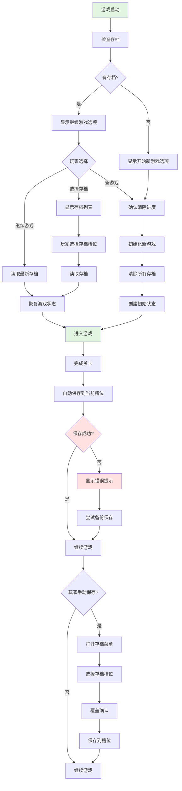
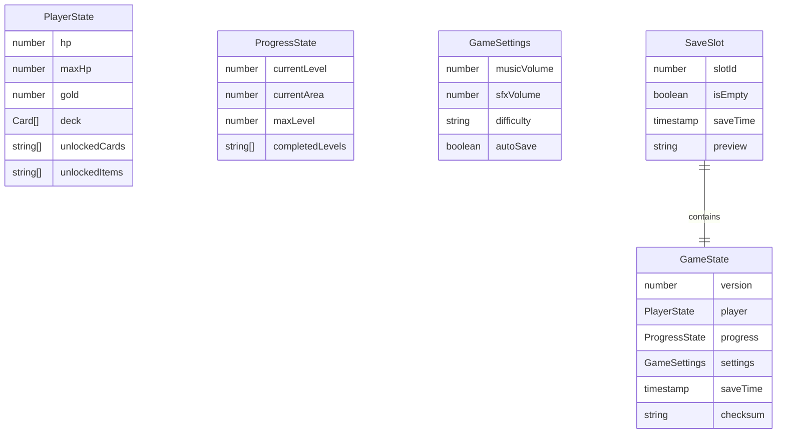

# Feature Spec: 游戏状态管理 (GameState)

> **版本**: 1.0
> **创建日期**: 2026-01-15
> **作者**: Spec Writer Agent
> **状态**: Draft

## Overview

### Problem Statement
卡牌策略游戏需要一个可靠的状态管理系统来保存和恢复玩家进度、游戏设置、关卡进度等信息。系统需要在适当的时机自动保存游戏状态，并支持手动存档和读档功能。

### Proposed Solution
实现一个 GameState 类，负责：
- 管理玩家全局状态（生命值、金币、卡组等）
- 管理关卡进度和区域信息
- 实现自动存档和手动存档
- 提供读档和重置功能
- 持久化存储到 localStorage
- 支持多个存档槽位

## User Stories

### Story 1: 自动保存游戏进度

```
As a 玩家,
I want to 在每关结束后自动保存游戏进度,
So that 我可以随时关闭游戏而不丢失进度。
```

**Priority**: High
**Estimate**: 5

#### Acceptance Criteria

- [ ] 每关结束后自动保存当前状态
- [ ] 保存内容包括：关卡进度、玩家生命值、卡组、金币、解锁内容
- [ ] 保存操作异步执行，不阻塞UI
- [ ] 保存失败时显示警告提示
- [ ] 存档使用最近的存档槽位

### Story 2: 手动保存和读取存档

```
As a 玩家,
I want to 手动保存游戏并在需要时读取存档,
So that 我可以尝试不同的策略或回到之前的状态。
```

**Priority**: Medium
**Estimate**: 6

#### Acceptance Criteria

- [ ] 提供3个独立的存档槽位
- [ ] 每个槽位显示存档信息（时间、关卡、生命值）
- [ ] 可以覆盖现有存档
- [ ] 读档后恢复完整游戏状态
- [ ] 读档时提示确认，避免误操作

### Story 3: 新游戏与重置进度

```
As a 玩家,
I want to 开始新游戏或重置进度,
So that 我可以重新体验游戏或尝试不同的卡组构建。
```

**Priority**: Medium
**Estimate**: 4

#### Acceptance Criteria

- [ ] 可以从主菜单开始新游戏
- [ ] 开始新游戏时提示确认，清除现有进度
- [ ] 重置后清除所有存档和设置
- [ ] 永久解锁内容不被清除

### Story 4: 存档数据完整性

```
As a 玩家,
I want to 确保存档数据完整且可恢复,
So that 我不会因为存档损坏而丢失进度。
```

**Priority**: High
**Estimate**: 5

#### Acceptance Criteria

- [ ] 保存前验证数据完整性
- [ ] 存档包含版本信息和校验和
- [ ] 读取时验证版本兼容性
- [ ] 损坏的存档被标记为不可用
- [ ] 自动备份存档到多个槽位

## Requirements

### Functional Requirements

| ID | Requirement | Priority | Status |
|----|-------------|----------|--------|
| FR-001 | 系统必须管理玩家全局状态（生命值、金币、卡组等） | Must | - |
| FR-002 | 系统必须管理关卡进度和区域信息 | Must | - |
| FR-003 | 系统必须在每关结束后自动保存 | Must | - |
| FR-004 | 系统必须支持3个独立的存档槽位 | Must | - |
| FR-005 | 系统必须支持手动保存和读取 | Must | - |
| FR-006 | 系统必须持久化存储到 localStorage | Must | - |
| FR-007 | 系统必须验证存档数据完整性 | Must | - |
| FR-008 | 系统必须支持版本兼容性检查 | Should | - |
| FR-009 | 系统必须支持重置游戏进度 | Should | - |
| FR-010 | 系统必须保存游戏设置（音量、难度等） | Should | - |

### Non-Functional Requirements

| Category | Requirement | Metric |
|----------|-------------|--------|
| Performance | 保存操作时间 | < 100ms |
| Performance | 读取操作时间 | < 200ms |
| Reliability | 存档完整性 | 100% 验证 |
| Reliability | 数据持久化 | localStorage 可靠性 |
| Security | 数据验证 | 版本检查 + 校验和 |
| Maintainability | 代码模块化 | 单一职责原则 |

## Scope

### In Scope

- 玩家全局状态管理（生命值、金币、卡组、解锁内容）
- 关卡进度和区域信息管理
- 自动存档（每关结束）
- 手动存档和读档（3个槽位）
- 存档数据验证和完整性检查
- 版本兼容性处理
- 游戏设置存储
- 新游戏和重置进度

### Out of Scope

- 云存档同步
- 多设备存档共享
- 存档导出/导入
- 存档编辑器
- 回合内即时存档
- 多人存档管理

## User Flow



### Step by Step

1. **游戏启动检查**
   - 触发条件: 游戏启动
   - 用户操作: 无（自动）
   - 系统响应: 检查 localStorage 中是否有存档，显示相应菜单

2. **读取存档**
   - 触发条件: 玩家选择继续游戏或选择存档槽位
   - 用户操作: 点击存档槽位
   - 系统响应: 验证存档完整性，恢复游戏状态

3. **自动保存**
   - 触发条件: 关卡结束
   - 用户操作: 无（自动）
   - 系统响应: 保存当前状态到当前槽位，验证成功

4. **手动保存**
   - 触发条件: 玩家打开存档菜单
   - 用户操作: 选择存档槽位并确认
   - 系统响应: 保存到指定槽位，显示成功提示

## UI/UX Requirements

### Screens

| Screen | Description | Mockup Link |
|--------|-------------|-------------|
| 主菜单 | 显示开始新游戏、继续游戏、存档管理 | docs/mockups/main-menu.md |
| 存档菜单 | 显示3个存档槽位和存档信息 | docs/mockups/save-menu.md |

### Interactions

| Element | Interaction | Behavior |
|---------|-------------|----------|
| 新游戏按钮 | 点击 | 确认后清除所有存档，开始新游戏 |
| 继续游戏按钮 | 点击 | 读取最新存档继续游戏 |
| 存档槽位 | 点击 | 显示详细信息，确认后读取或覆盖 |
| 保存按钮 | 点击 | 保存到当前槽位或选择槽位 |
| 删除存档按钮 | 点击 | 确认后删除存档 |

## Data Model

### Entities



### Data Fields

| Field | Type | Required | Constraints | Description |
|-------|------|----------|-------------|-------------|
| version | number | Yes | Positive integer | 存档版本号 |
| hp | number | Yes | Min: 0, Max: maxHp | 当前生命值 |
| maxHp | number | Yes | Min: 1 | 最大生命值 |
| gold | number | Yes | Min: 0 | 金币数量 |
| deck | array | Yes | Max length: 20 | 玩家卡组 |
| currentLevel | number | Yes | Min: 1 | 当前关卡 |
| currentArea | number | Yes | Min: 1 | 当前区域 |
| saveTime | timestamp | Yes | - | 保存时间 |
| checksum | string | Yes | - | 数据校验和 |

## API Requirements

### Public Methods

| Method | Parameters | Returns | Description |
|--------|------------|---------|-------------|
| `initNewGame()` | - | Promise<void> | 初始化新游戏状态 |
| `autoSave()` | - | Promise<boolean> | 自动保存到当前槽位 |
| `saveToSlot(slotId)` | number | Promise<boolean> | 保存到指定槽位 |
| `loadFromSlot(slotId)` | number | Promise<GameState> | 从指定槽位读取存档 |
| `loadLatestSave()` | - | Promise<GameState> | 读取最新存档 |
| `getSaveSlots()` | - | Promise<SaveSlot[]> | 获取所有存档槽位信息 |
| `deleteSave(slotId)` | number | Promise<boolean> | 删除指定存档 |
| `resetGame()` | - | Promise<void> | 重置游戏进度 |
| `exportSave(slotId)` | number | Promise<string> | 导出存档为JSON字符串 |
| `importSave(data, slotId)` | string, number | Promise<boolean> | 导入存档数据 |
| `validateSave(data)` | any | boolean | 验证存档数据完整性 |
| `updatePlayerState(updates)` | object | void | 更新玩家状态 |

## Dependencies

| Dependency | Type | Status | Notes |
|------------|------|--------|-------|
| localStorage | External | Required | 浏览器本地存储 |
| CardManager | Internal | Required | 卡组数据验证 |
| LevelManager | Internal | Required | 关卡数据验证 |

## Implementation Plan

### Phases

#### Phase 1: 数据结构设计

**Goal**: 建立状态数据模型

| Task | Estimate | Owner | Status |
|------|----------|-------|--------|
| 设计 GameState 数据结构 | 2h | - | - |
| 设计 PlayerState 子结构 | 1h | - | - |
| 设计 ProgressState 子结构 | 1h | - | - |
| 实现数据验证函数 | 2h | - | - |

#### Phase 2: 存储和持久化

**Goal**: 实现 localStorage 操作

| Task | Estimate | Owner | Status |
|------|----------|-------|--------|
| 实现保存到 localStorage | 2h | - | - |
| 实现从 localStorage 读取 | 2h | - | - |
| 实现数据序列化/反序列化 | 2h | - | - |
| 实现校验和计算 | 1h | - | - |

#### Phase 3: 存档管理

**Goal**: 实现存档槽位管理

| Task | Estimate | Owner | Status |
|------|----------|-------|--------|
| 实现存档槽位管理 | 3h | - | - |
| 实现自动保存逻辑 | 2h | - | - |
| 实现手动保存和读取 | 3h | - | - |
| 实现存档列表显示 | 2h | - | - |

#### Phase 4: 验证和错误处理

**Goal**: 确保数据完整性

| Task | Estimate | Owner | Status |
|------|----------|-------|--------|
| 实现数据完整性验证 | 2h | - | - |
| 实现版本兼容性检查 | 2h | - | - |
| 实现错误恢复机制 | 2h | - | - |
| 编写测试用例 | 3h | - | - |

## Testing Strategy

### Test Types

- [x] Unit Tests
- [x] Integration Tests
- [ ] E2E Tests
- [ ] Performance Tests
- [ ] Security Tests

### Test Cases

| ID | Scenario | Expected Result | Status |
|----|----------|-----------------|--------|
| TC-001 | 初始化新游戏 | 创建默认玩家状态，关卡为1 | - |
| TC-002 | 保存有效状态 | 成功保存到 localStorage | - |
| TC-003 | 读取有效存档 | 完整恢复游戏状态 | - |
| TC-004 | 读取损坏存档 | 返回错误或 null，显示警告 | - |
| TC-005 | 保存到满额槽位 | 覆盖现有存档 | - |
| TC-006 | 读取空槽位 | 返回 null 或默认状态 | - |
| TC-007 | 自动保存 | 保存到当前槽位，不提示 | - |
| TC-008 | 手动保存 | 保存到指定槽位，显示成功提示 | - |
| TC-009 | 重置游戏 | 清除所有存档和设置 | - |
| TC-010 | 版本不兼容 | 显示警告，拒绝读取或尝试迁移 | - |
| TC-011 | 校验和不匹配 | 标记存档为损坏 | - |
| TC-012 | localStorage 不可用 | 降级到内存存储，显示警告 | - |
| TC-013 | 导出存档 | 返回有效的 JSON 字符串 | - |
| TC-014 | 导入有效存档 | 成功导入并验证 | - |
| TC-015 | 导入无效存档 | 拒绝导入，显示错误提示 | - |

### Edge Cases

| ID | Edge Case | Expected Behavior |
|----|-----------|-------------------|
| EC-001 | localStorage 已满 | 清理旧存档或降级到内存存储 |
| EC-002 | 存档版本号不匹配 | 尝试迁移或拒绝读取 |
| EC-003 | 数据字段缺失 | 使用默认值或标记为无效 |
| EC-004 | 保存时系统时间错误 | 使用相对时间或忽略时间戳 |
| EC-005 | 同时触发多次保存 | 队列化保存操作，避免冲突 |

## Business Rules

### BR-001: 自动保存规则
- 每关结束后自动保存
- 保存到当前使用的存档槽位
- 如果无当前槽位，使用槽位1
- 保存失败时尝试备份到其他槽位

### BR-002: 存档槽位规则
- 提供3个独立的存档槽位
- 每个槽位可以独立读写
- 同一槽位的新存档覆盖旧存档
- 槽位显示保存时间、关卡、生命值等信息

### BR-003: 数据完整性规则
- 保存前验证所有必需字段
- 计算并保存校验和
- 读取时验证校验和
- 损坏的存档被标记为不可用

### BR-004: 版本兼容性规则
- 每个存档包含版本号
- 读取时检查版本兼容性
- 不兼容的存档显示警告
- 尝试迁移旧版本存档

### BR-005: 重置规则
- 重置游戏清除所有存档
- 永久解锁内容保留
- 重置前需要确认
- 重置后创建新的初始状态

## Error Handling

| Error Code | Error Message | Cause | Resolution |
|------------|---------------|-------|------------|
| ERR_STORAGE_UNAVAILABLE | "存储不可用" | localStorage 不支持 | 降级到内存存储 |
| ERR_STORAGE_FULL | "存储空间不足" | localStorage 已满 | 清理旧存档或提示用户 |
| ERR_SAVE_CORRUPTED | "存档已损坏" | 校验和不匹配 | 标记为不可用，尝试恢复 |
| ERR_VERSION_INCOMPATIBLE | "存档版本不兼容" | 版本号不匹配 | 尝试迁移或拒绝读取 |
| ERR_SLOT_INVALID | "无效的存档槽位" | 槽位ID超出范围 | 检查槽位ID有效性 |
| ERR_SAVE_FAILED | "保存失败" | 保存操作失败 | 尝试重试或使用备用槽位 |
| ERR_LOAD_FAILED | "读取失败" | 读取操作失败 | 检查存档存在性和完整性 |

## Risks & Mitigations

| Risk | Probability | Impact | Mitigation Strategy |
|------|-------------|--------|---------------------|
| localStorage 数据丢失 | Low | High | 实现备份机制和降级方案 |
| 存档版本不兼容 | Medium | High | 实现迁移逻辑和版本检查 |
| 存档损坏 | Low | High | 实现校验和验证和备份 |
| 存储空间不足 | Low | Medium | 清理旧存档或提示用户 |
| 浏览器隐私模式 | Medium | Medium | 降级到内存存储并提示 |

## Success Metrics

| Metric | Target | How to Measure |
|--------|--------|----------------|
| 存档成功率 | > 99% | 存档操作日志 |
| 读取成功率 | > 99% | 读取操作日志 |
| 数据完整性 | 100% | 校验和验证 |
| 自动保存覆盖率 | 100% | 关卡完成统计 |
| 平均保存时间 | < 100ms | 性能测试 |

## Rollout Plan

### Stages

1. **Alpha**: 基本存档功能 (Week 1)
2. **Beta**: 多槽位和验证 (Week 2)
3. **GA**: 完整功能 (Week 3)

### Feature Flags

| Flag | Description | Default |
|------|-------------|---------|
| `enableAutoSave` | 启用自动保存 | true |
| `enableMultipleSlots` | 启用多槽位 | true |
| `strictValidation` | 严格数据验证 | true |

## Monitoring & Alerting

### Metrics to Track

- 存档操作成功率
- 平均保存/读取时间
- 存档损坏率
- 存储空间使用量
- 版本不兼容事件

### Alert Conditions

| Condition | Severity | Action |
|-----------|----------|--------|
| 存档失败率 > 5% | Critical | 立即检查存储系统 |
| 存档损坏率 > 1% | Critical | 验证数据完整性 |
| 平均保存时间 > 500ms | Warning | 性能优化 |

## Changelog

| Version | Date | Changes | Author |
|---------|------|---------|--------|
| 1.0 | 2026-01-15 | 初始版本 | Spec Writer Agent |
