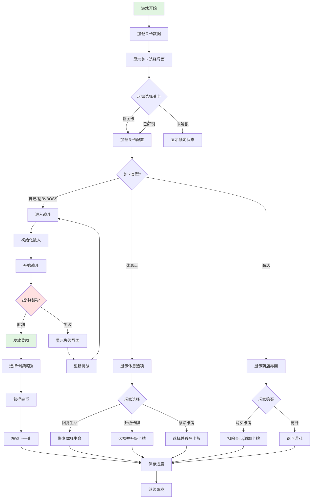
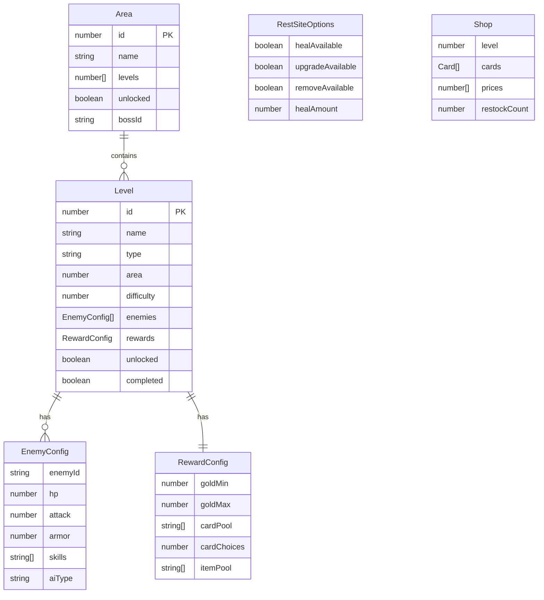

# Feature Spec: 关卡系统 (LevelManager)

> **版本**: 1.0
> **创建日期**: 2026-01-15
> **作者**: Spec Writer Agent
> **状态**: Draft

## Overview

### Problem Statement
卡牌策略游戏需要一个完整的关卡管理系统来处理关卡加载、敌人配置、关卡进度和奖励发放。系统需要支持多种关卡类型、动态难度调整和丰富的奖励机制。

### Proposed Solution
实现一个 LevelManager 类，负责：
- 管理关卡数据和配置
- 加载和初始化关卡
- 配置敌人属性和行为
- 处理关卡进度和解锁
- 发放战斗奖励
- 管理商店和休息点
- 实现动态难度调整

## User Stories

### Story 1: 关卡加载与初始化

```
As a 玩家,
I want to 进入关卡后看到正确的敌人配置和环境,
So that 我可以开始战斗并享受不同的关卡体验。
```

**Priority**: High
**Estimate**: 8

#### Acceptance Criteria

- [ ] 从关卡数据文件加载关卡配置
- [ ] 初始化敌人属性（生命值、攻击力、技能）
- [ ] 设置关卡环境和背景
- [ ] 加载关卡特定的规则和限制
- [ ] 触发关卡开始事件
- [ ] 关卡加载失败时显示错误提示

### Story 2: 多种关卡类型

```
As a 玩家,
I want to 体验不同类型的关卡（普通战、精英战、BOSS战、休息点、事件）,
So that 游戏玩法丰富多样。
```

**Priority**: High
**Estimate**: 8

#### Acceptance Criteria

- [ ] 普通战：常规敌人，标准奖励
- [ ] 精英战：强力敌人，稀有奖励
- [ ] BOSS战：独特机制，丰富奖励
- [ ] 休息点：回复生命、升级卡牌、移除卡牌
- [ ] 事件：随机选择，风险与收益并存
- [ ] 关卡类型正确标识和显示

### Story 3: 关卡进度与解锁

```
As a 玩家,
I want to 完成关卡后解锁新内容并记录进度,
So that 我可以继续探索游戏世界。
```

**Priority**: High
**Estimate**: 6

#### Acceptance Criteria

- [ ] 完成关卡后解锁下一关
- [ ] 完成BOSS战后解锁新区域
- [ ] 记录已完成的关卡
- [ ] 显示关卡进度（当前关卡/区域）
- [ ] 失败后可以重新挑战
- [ ] 进度自动保存

### Story 4: 战斗奖励发放

```
As a 玩家,
I want to 在战斗胜利后获得奖励（金币、卡牌、道具）,
So that 我可以不断增强角色实力。
```

**Priority**: High
**Estimate**: 6

#### Acceptance Criteria

- [ ] 普通战奖励：金币 + 3张随机卡牌选择
- [ ] 精英战奖励：更多金币 + 稀有卡牌选择
- [ ] BOSS战奖励：大量金币 + 稀有/史诗卡牌
- [ ] 奖励从对应关卡级别的奖池中随机
- [ ] 玩家只能选择1张卡牌
- [ ] 奖励正确添加到玩家状态

### Story 5: 商店与休息点

```
As a 玩家,
I want to 在休息点回复生命、升级卡牌或访问商店,
So that 我可以更好地准备后续挑战。
```

**Priority**: Medium
**Estimate**: 5

#### Acceptance Criteria

- [ ] 休息点提供3个选项：回复生命、升级卡牌、移除卡牌
- [ ] 回复生命：恢复30%最大生命值
- [ ] 升级卡牌：从3张卡牌中选择1张升级
- [ ] 移除卡牌：从卡组中移除1张卡牌
- [ ] 商店提供卡牌购买功能
- [ ] 商店价格根据关卡难度调整

## Requirements

### Functional Requirements

| ID | Requirement | Priority | Status |
|----|-------------|----------|--------|
| FR-001 | 系统必须支持从配置文件加载关卡数据 | Must | - |
| FR-002 | 系统必须支持多种关卡类型（普通、精英、BOSS、休息、事件） | Must | - |
| FR-003 | 系统必须正确配置敌人属性和行为 | Must | - |
| FR-004 | 系统必须管理关卡进度和解锁 | Must | - |
| FR-005 | 系统必须根据关卡类型发放正确奖励 | Must | - |
| FR-006 | 系统必须支持休息点功能 | Must | - |
| FR-007 | 系统必须支持商店系统 | Should | - |
| FR-008 | 系统必须实现动态难度调整 | Should | - |
| FR-009 | 系统必须支持随机事件 | Should | - |
| FR-010 | 系统必须验证关卡数据完整性 | Must | - |

### Non-Functional Requirements

| Category | Requirement | Metric |
|----------|-------------|--------|
| Performance | 关卡加载时间 | < 200ms |
| Performance | 奖励生成时间 | < 50ms |
| Reliability | 关卡数据完整性 | 100% 验证 |
| Maintainability | 代码模块化 | 单一职责原则 |
| Scalability | 关卡数量扩展 | 支持100+关卡 |

## Scope

### In Scope

- 关卡数据加载和管理
- 多种关卡类型（普通、精英、BOSS、休息、事件）
- 敌人配置和初始化
- 关卡进度和解锁系统
- 战斗奖励发放
- 休息点功能
- 商店系统
- 动态难度调整
- 关卡数据验证

### Out of Scope

- 关卡编辑器
- 自定义关卡
- 用户生成内容
- 多人合作关卡
- 实时关卡更新
- 关卡排行榜

## User Flow



### Step by Step

1. **关卡加载**
   - 触发条件: 玩家选择关卡
   - 用户操作: 点击关卡
   - 系统响应: 加载关卡配置，初始化敌人，进入相应场景

2. **战斗关卡**
   - 触发条件: 进入普通/精英/BOSS关卡
   - 用户操作: 战斗
   - 系统响应: 初始化战斗，胜利后发放奖励

3. **休息点**
   - 触发条件: 进入休息点关卡
   - 用户操作: 选择服务
   - 系统响应: 执行选择的服务，更新玩家状态

4. **商店**
   - 触发条件: 进入商店关卡
   - 用户操作: 购买商品
   - 系统响应: 扣除金币，添加商品，保存进度

## UI/UX Requirements

### Screens

| Screen | Description | Mockup Link |
|--------|-------------|-------------|
| 关卡选择 | 显示所有可用关卡和进度 | docs/mockups/level-select.md |
| 战斗准备 | 显示敌人信息和奖励预览 | docs/mockups/battle-prep.md |
| 奖励界面 | 显示战斗奖励供玩家选择 | docs/mockups/reward-screen.md |
| 休息点 | 显示休息选项 | docs/mockups/rest-site.md |
| 商店 | 显示可购买的卡牌 | docs/mockups/shop.md |

### Interactions

| Element | Interaction | Behavior |
|---------|-------------|----------|
| 关卡图标 | 点击 | 加载并进入关卡 |
| 未解锁关卡 | 点击 | 显示锁定提示和前置要求 |
| 奖励卡牌 | 点击 | 选择并添加到卡组 |
| 休息选项 | 点击 | 执行对应操作 |
| 商店商品 | 点击 | 购买（如果金币足够） |

## Data Model

### Entities



### Data Fields

| Field | Type | Required | Constraints | Description |
|-------|------|----------|-------------|-------------|
| id | number | Yes | Positive, unique | 关卡ID |
| name | string | Yes | Length: 1-50 chars | 关卡名称 |
| type | string | Yes | Values: normal/elite/boss/rest/event/shop | 关卡类型 |
| area | number | Yes | Positive | 所属区域 |
| difficulty | number | Yes | Range: 1-10 | 难度等级 |
| enemies | array | Yes | Non-empty for combat levels | 敌人配置列表 |
| rewards | object | Yes | Valid reward config | 奖励配置 |
| unlocked | boolean | Yes | - | 是否已解锁 |
| completed | boolean | Yes | - | 是否已完成 |

## API Requirements

### Public Methods

| Method | Parameters | Returns | Description |
|--------|------------|---------|-------------|
| `loadLevelData()` | - | Promise<void> | 加载所有关卡数据 |
| `getLevel(levelId)` | number | Level | 获取指定关卡数据 |
| `loadLevel(levelId)` | number | Promise<void> | 加载并初始化关卡 |
| `initCombatLevel(levelId)` | number | Promise<void> | 初始化战斗关卡 |
| `initRestSite(levelId)` | number | Promise<void> | 初始化休息点 |
| `initShop(levelId)` | number | Promise<void> | 初始化商店 |
| `completeLevel(levelId)` | number | Promise<void> | 完成关卡，解锁下一关 |
| `generateRewards(levelId)` | number | Reward[] | 生成关卡奖励 |
| `giveReward(reward)` | Reward | Promise<void> | 发放奖励给玩家 |
| `unlockLevel(levelId)` | number | void | 解锁指定关卡 |
| `getLevelsByArea(areaId)` | number | Level[] | 获取区域的所有关卡 |
| `getNextLevel(levelId)` | number | Level | 获取下一关 |
| `isLevelUnlocked(levelId)` | number | boolean | 检查关卡是否解锁 |
| `adjustDifficulty(baseDifficulty, playerPerformance)` | number, number | number | 根据玩家表现调整难度 |
| `validateLevelData(level)` | Level | boolean | 验证关卡数据完整性 |

## Dependencies

| Dependency | Type | Status | Notes |
|------------|------|--------|-------|
| levels.json | Internal | Required | 关卡数据文件 |
| enemies.json | Internal | Required | 敌人数据文件 |
| cards.json | Internal | Required | 卡牌数据文件 |
| GameState | Internal | Required | 更新玩家状态 |
| CombatSystem | Internal | Required | 初始化战斗 |
| CardManager | Internal | Required | 发放卡牌奖励 |

## Implementation Plan

### Phases

#### Phase 1: 关卡数据结构

**Goal**: 建立关卡数据模型

| Task | Estimate | Owner | Status |
|------|----------|-------|--------|
| 设计关卡数据结构 | 2h | - | - |
| 创建 levels.json | 3h | - | - |
| 创建 enemies.json | 3h | - | - |
| 实现数据加载函数 | 2h | - | - |
| 实现数据验证函数 | 2h | - | - |

#### Phase 2: 关卡管理

**Goal**: 实现关卡加载和进度

| Task | Estimate | Owner | Status |
|------|----------|-------|--------|
| 实现关卡加载 | 3h | - | - |
| 实现关卡解锁 | 2h | - | - |
| 实现关卡完成 | 2h | - | - |
| 实现进度保存 | 2h | - | - |
| 编写关卡管理测试 | 2h | - | - |

#### Phase 3: 战斗关卡

**Goal**: 实现战斗关卡功能

| Task | Estimate | Owner | Status |
|------|----------|-------|--------|
| 实现敌人初始化 | 3h | - | - |
| 实现奖励生成 | 3h | - | - |
| 实现奖励发放 | 2h | - | - |
| 实现战斗关卡流程 | 3h | - | - |

#### Phase 4: 休息点与商店

**Goal**: 实现非战斗关卡

| Task | Estimate | Owner | Status |
|------|----------|-------|--------|
| 实现休息点功能 | 4h | - | - |
| 实现商店系统 | 5h | - | - |
| 实现随机事件 | 4h | - | - |
| 集成测试 | 3h | - | - |

## Testing Strategy

### Test Types

- [x] Unit Tests
- [x] Integration Tests
- [ ] E2E Tests
- [ ] Performance Tests
- [ ] Balance Tests

### Test Cases

| ID | Scenario | Expected Result | Status |
|----|----------|-----------------|--------|
| TC-001 | 加载有效关卡数据 | 成功加载所有关卡 | - |
| TC-002 | 加载无效的关卡数据 | 抛出错误或使用默认值 | - |
| TC-003 | 初始化普通关卡 | 加载敌人配置，开始战斗 | - |
| TC-004 | 初始化精英关卡 | 加载强力敌人，设置稀有奖励 | - |
| TC-005 | 初始化BOSS关卡 | 加载BOSS敌人，设置丰富奖励 | - |
| TC-006 | 初始化休息点 | 显示休息选项 | - |
| TC-007 | 完成关卡 | 解锁下一关，保存进度 | - |
| TC-008 | 生成普通战奖励 | 金币 + 3张普通卡牌 | - |
| TC-009 | 生成精英战奖励 | 更多金币 + 稀有卡牌 | - |
| TC-010 | 生成BOSS战奖励 | 大量金币 + 稀有/史诗卡牌 | - |
| TC-011 | 发放卡牌奖励 | 玩家选择1张，添加到卡组 | - |
| TC-012 | 休息点回复生命 | 恢复30%最大生命值 | - |
| TC-013 | 休息点升级卡牌 | 选择1张卡牌并升级 | - |
| TC-014 | 休息点移除卡牌 | 选择1张卡牌并移除 | - |
| TC-015 | 商店购买卡牌 | 扣除金币，添加卡牌 | - |
| TC-016 | 商店金币不足 | 无法购买，显示提示 | - |
| TC-017 | 动态难度调整 | 根据玩家表现调整敌人属性 | - |
| TC-018 | 解锁关卡 | 设置解锁标志，保存进度 | - |
| TC-019 | 验证关卡数据 | 返回验证结果 | - |
| TC-020 | 加载不存在的关卡 | 返回错误或null | - |

### Edge Cases

| ID | Edge Case | Expected Behavior |
|----|-----------|-------------------|
| EC-001 | 关卡数据文件不存在 | 抛出错误，使用默认关卡 |
| EC-002 | 敌人配置为空 | 使用默认敌人配置 |
| EC-003 | 奖励池为空 | 使用默认奖励 |
| EC-004 | 卡组已满时获得卡牌奖励 | 拒绝添加，显示警告 |
| EC-005 | 商店无可用商品 | 显示"已售罄" |
| EC-006 | 连续完成相同关卡 | 正常处理，不重复解锁 |
| EC-007 | 跳过关卡（未完成前一关） | 拒绝进入，显示前置要求 |
| EC-008 | 休息点生命值已满 | 显示"已满"但仍可选择 |

## Business Rules

### BR-001: 关卡解锁规则
- 必须完成前一关才能解锁下一关
- 完成BOSS战后解锁新区域
- 普通关卡和精英关卡并行解锁
- 休息点和商店自动解锁

### BR-002: 奖励规则
- 普通战：20-30金币 + 3张普通卡牌选择
- 精英战：40-60金币 + 3张卡牌（至少1张稀有）
- BOSS战：100金币 + 3张卡牌（至少1张稀有/史诗）
- 奖励卡牌从对应关卡级别的奖池中随机
- 玩家只能选择1张卡牌
- 卡组满时无法获得卡牌

### BR-003: 休息点规则
- 回复生命：恢复30%最大生命值
- 升级卡牌：从卡组随机选3张，选择1张升级
- 移除卡牌：从卡组选择1张移除
- 每次只能选择1个选项
- 选择后离开休息点

### BR-004: 商店规则
- 商店提供3-5张随机卡牌
- 普通卡：50金币
- 稀有卡：100金币
- 史诗卡：200金币
- 价格根据关卡难度调整（±20%）
- 购买后卡牌从商店移除

### BR-005: 动态难度规则
- 根据玩家胜率调整敌人属性（±10%）
- 根据金币数量调整奖励（±10%）
- 根据卡组强度调整敌人强度
- 调整范围限制在±20%以内

## Error Handling

| Error Code | Error Message | Cause | Resolution |
|------------|---------------|-------|------------|
| ERR_LEVEL_NOT_FOUND | "关卡不存在: {levelId}" | 关卡ID无效 | 检查关卡ID |
| ERR_LEVEL_DATA_INVALID | "关卡数据无效" | 关卡配置错误 | 修复关卡数据 |
| ERR_ENEMY_CONFIG_INVALID | "敌人配置无效" | 敌人数据缺失 | 使用默认敌人 |
| ERR_REWARD_FAILED | "奖励发放失败" | 卡组已满或其他原因 | 显示错误提示 |
| ERR_INSUFFICIENT_GOLD | "金币不足" | 购买商品金币不够 | 提示玩家 |
| ERR_LEVEL_LOCKED | "关卡未解锁" | 尝试进入未解锁关卡 | 显示前置要求 |
| ERR_REST_SITE_FAILED | "休息点操作失败" | 休息点配置错误 | 检查配置 |

## Risks & Mitigations

| Risk | Probability | Impact | Mitigation Strategy |
|------|-------------|--------|---------------------|
| 关卡数据不平衡 | High | High | 持续收集数据，调整平衡 |
| 奖励池枯竭 | Low | Medium | 设计丰富的卡牌池 |
| 动态难度过度调整 | Medium | Medium | 限制调整范围 |
| 关卡进度丢失 | Low | High | 实现可靠存档系统 |
| 商店经济失衡 | Medium | Medium | 定期审查价格和奖励 |

## Success Metrics

| Metric | Target | How to Measure |
|--------|--------|----------------|
| 关卡完成率 | 60-80% | 关卡完成统计 |
| 平均通关时长 | 2-4小时 | 游戏时间统计 |
| 玩家满意度 | > 4.0/5.0 | 用户反馈 |
| 关卡难度平衡性 | 胜率40-60% | 胜率统计 |
| 奖励吸引力 | > 80%选择率 | 奖励选择统计 |

## Rollout Plan

### Stages

1. **Alpha**: 基础关卡系统 (Week 1-2)
2. **Beta**: 休息点和商店 (Week 3-4)
3. **GA**: 平衡调整和优化 (Week 5)

### Feature Flags

| Flag | Description | Default |
|------|-------------|---------|
| `enableDynamicDifficulty` | 启用动态难度 | true |
| `enableShop` | 启用商店系统 | true |
| `enableRandomEvents` | 启用随机事件 | true |
| `strictValidation` | 严格关卡数据验证 | true |

## Monitoring & Alerting

### Metrics to Track

- 关卡完成率（按关卡类型）
- 平均通关时长
- 玩家金币积累
- 卡牌选择偏好
- 休息点选择频率
- 商店购买率
- 关卡失败率

### Alert Conditions

| Condition | Severity | Action |
|-----------|----------|--------|
| 关卡完成率 < 30% | Warning | 降低难度 |
| 关卡完成率 > 90% | Warning | 提高难度 |
| 关卡加载失败 | Critical | 检查数据文件 |
| 奖励发放失败 | Critical | 检查奖励逻辑 |

## Changelog

| Version | Date | Changes | Author |
|---------|------|---------|--------|
| 1.0 | 2026-01-15 | 初始版本 | Spec Writer Agent |
