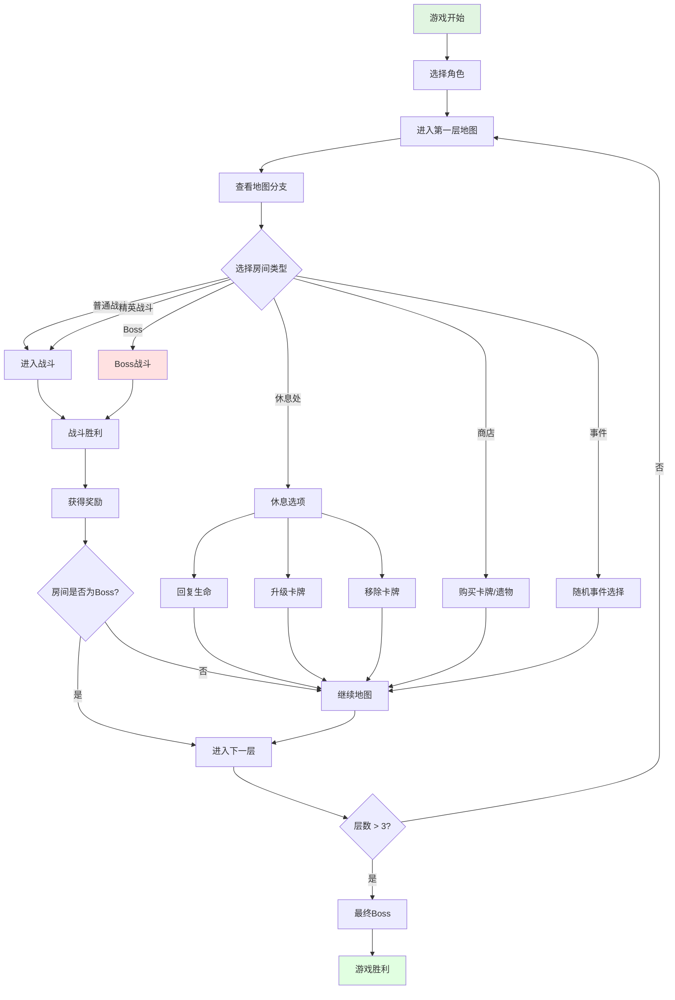
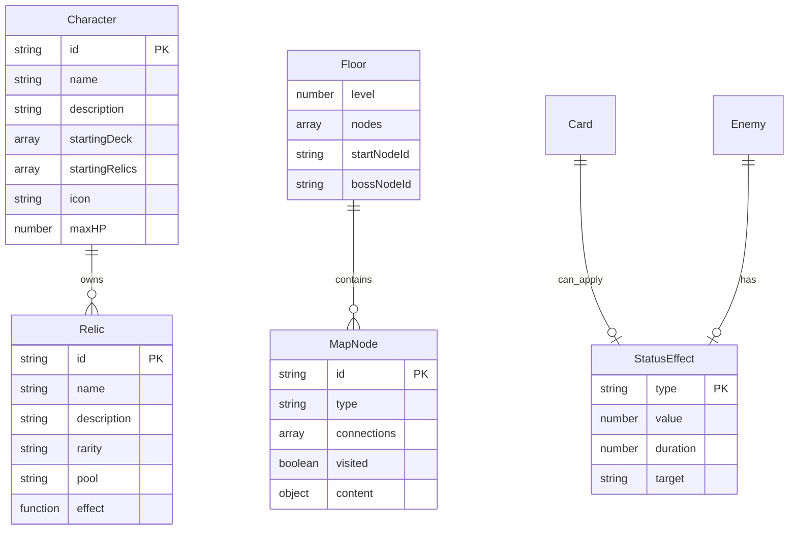

# Feature Spec: Roguelike 卡牌构筑游戏改造

> **版本**: 1.0
> **创建日期**: 2026-02-09
> **作者**: Spec Writer Agent
> **状态**: Draft

## Overview

### Problem Statement
现有 game_flow 项目是一个基础的纯 JavaScript 卡牌游戏 demo，缺乏 Roguelike 游戏的核心要素，如：
- 缺乏深度卡牌构筑系统
- 缺乏状态效果和复杂战斗机制
- 缺乏遗物和角色成长系统
- 缺乏地图探索和分支选择
- 缺乏重玩价值

### Proposed Solution
将现有项目改造成类似《杀戮尖塔》的 Roguelike 卡牌构筑游戏，实现以下核心系统：
1. 扩展卡牌效果系统（状态效果、格挡、能量管理）
2. 改造战斗系统（意图显示、回合制流程、多阶段Boss）
3. 新增遗物系统（被动效果、流派引导）
4. 新增地图关卡系统（分支路径、多种房间类型）
5. 新增角色成长系统（多角色、卡牌升级/移除）

## User Stories

### Story 1: 玩家体验完整战斗系统

```
As a 玩家,
I want to 在战斗中看到敌人的意图并使用状态效果卡牌,
So that 我可以制定更深的策略来应对不同敌人。
```

**Priority**: High
**Estimate**: 8

#### Acceptance Criteria

- [ ] 敌人头顶清晰显示下回合意图（攻击/防御/技能）
- [ ] 状态效果（力量、虚弱、易伤、中毒、再生）正确生效
- [ ] 格挡值在回合结束时清零
- [ ] 能量每回合恢复到 3 点
- [ ] 手牌上限为 10 张，超过的卡牌被销毁

### Story 2: 玩家获得遗物并构建流派

```
As a 玩家,
I want to 通过战斗获得遗物并根据卡组构成获得匹配的遗物,
So that 我可以构建独特的卡组流派。
```

**Priority**: High
**Estimate**: 8

#### Acceptance Criteria

- [ ] 击败精英敌人和 Boss 必定掉落遗物
- [ ] 遗物提供被动效果且在战斗中自动生效
- [ ] 流派引导算法根据卡组构成调整遗物掉落
- [ ] 遗物有稀有度区分（普通/稀有/专属）

### Story 3: 玩家在地图上选择路线

```
As a 玩家,
I want to 在分支路径中选择不同的房间类型,
So that 我可以平衡风险和收益来优化通关策略。
```

**Priority**: High
**Estimate**: 8

#### Acceptance Criteria

- [ ] 地图显示带有分支的路线图
- [ ] 房间类型包括：普通战斗、精英战斗、休息处、商店、宝藏、事件、Boss
- [ ] 黄金配比：战斗50%、安全30%、随机20%
- [ ] 选择房间后进入对应内容

### Story 4: 玩家选择角色并成长

```
As a 玩家,
I want to 在游戏开始时选择不同角色并在游戏过程中升级卡牌,
So that 每次游玩都有不同的体验和策略。
```

**Priority**: Medium
**Estimate**: 5

#### Acceptance Criteria

- [ ] 游戏开始时可以选择多个角色之一
- [ ] 每个角色有独特的初始卡组和核心遗物
- [ ] 在休息处可以升级或移除卡牌
- [ ] 卡牌升级提升伤害或减少能量消耗

## Requirements

### Functional Requirements

| ID | Requirement | Priority | Status |
|----|-------------|----------|--------|
| FR-001 | 系统必须支持状态效果（力量、虚弱、易伤、中毒、再生） | Must | - |
| FR-002 | 系统必须实现格挡机制（回合结束清零） | Must | - |
| FR-003 | 系统必须实现能量系统（每回合3点，卡牌消耗） | Must | - |
| FR-004 | 系统必须实现手牌上限（10张，超过销毁） | Must | - |
| FR-005 | 系统必须显示敌人下回合意图 | Must | - |
| FR-006 | 系统必须实现完整的回合制战斗流程 | Must | - |
| FR-007 | 系统必须支持多阶段Boss（特殊机制和技能） | Must | - |
| FR-008 | 系统必须实现遗物系统（被动效果） | Must | - |
| FR-009 | 系统必须实现流派引导算法 | Should | - |
| FR-010 | 系统必须实现地图系统（分支路径） | Must | - |
| FR-011 | 系统必须支持多种房间类型 | Must | - |
| FR-012 | 系统必须实现黄金配比（战斗50%、安全30%、随机20%） | Should | - |
| FR-013 | 系统必须支持多角色选择 | Must | - |
| FR-014 | 系统必须支持卡牌升级和移除 | Must | - |

### Non-Functional Requirements

| Category | Requirement | Metric |
|----------|-------------|--------|
| Performance | 单帧渲染时间 | < 16ms (60fps) |
| Performance | 战斗操作响应时间 | < 100ms |
| Reliability | 存档成功率 | 100% |
| Maintainability | 模块化设计 | 单一职责原则 |
| Scalability | 卡牌数量支持 | 500+ 张 |
| Scalability | 遗物数量支持 | 100+ 个 |

## Scope

### In Scope

- 状态效果系统（力量、虚弱、易伤、中毒、再生）
- 格挡和能量管理机制
- 敌人意图显示系统
- 完整的回合制战斗流程
- 多阶段Boss机制
- 遗物系统和流派引导算法
- 地图系统和分支路径
- 多种房间类型
- 多角色系统
- 卡牌升级和移除

### Out of Scope

- 多人联机模式
- 实时PvP战斗
- 3D视觉效果
- 语音聊天
- 交易市场
- 排行榜系统

## User Flow



### Step by Step

1. **角色选择**
   - 触发条件: 游戏启动
   - 用户操作: 选择角色（如铁甲战士、盗贼、法师）
   - 系统响应: 加载角色专属初始卡组和核心遗物

2. **地图探索**
   - 触发条件: 进入新楼层
   - 用户操作: 在分支路径中选择下一个房间
   - 系统响应: 根据选择生成对应房间内容

3. **战斗流程**
   - 触发条件: 进入战斗房间
   - 用户操作: 查看敌人意图，打出卡牌
   - 系统响应: 执行卡牌效果，处理状态效果，敌人行动

4. **遗物获取**
   - 触发条件: 击败精英敌人或Boss
   - 用户操作: 从遗物池中选择一个遗物
   - 系统响应: 应用遗物效果到游戏状态

5. **卡牌管理**
   - 触发条件: 进入休息处
   - 用户操作: 选择升级卡牌、移除卡牌或回血
   - 系统响应: 执行对应操作

## UI/UX Requirements

### Screens

| Screen | Description | Elements |
|--------|-------------|----------|
| 角色选择界面 | 显示可选角色及其描述 | 角色卡片、初始卡组预览、核心遗物说明 |
| 地图界面 | 显示当前楼层的分支路径 | 节点图、房间类型图标、当前玩家位置 |
| 战斗界面 | 显示战斗状态和可执行操作 | 敌人意图、手牌、能量、状态效果、操作按钮 |
| 遗物选择界面 | 显示可选择的遗物 | 遗物列表、效果描述、稀有度标识 |
| 休息处界面 | 提供休息选项 | 回血、升级卡牌、移除卡牌按钮 |
| 商店界面 | 显示可购买的卡牌和遗物 | 商品列表、价格、金币显示 |
| 事件界面 | 显示随机事件和选项 | 事件描述、选项按钮、结果预览 |

### Interactions

| Element | Interaction | Behavior |
|---------|-------------|----------|
| 敌人意图图标 | 悬停 | 显示详细效果描述 |
| 状态效果图标 | 悬停 | 显示效果持续时间和数值 |
| 卡牌 | 悬停 | 显示卡牌详细信息和升级预览 |
| 地图节点 | 点击 | 选择并进入对应房间 |
| 遗物 | 悬停 | 显示遗物效果和来源 |

## Data Model

### Entities



### Data Fields

| Field | Type | Required | Constraints | Description |
|-------|------|----------|-------------|-------------|
| **Character** |||||||
| id | string | Yes | Format: "char_XXX" | 角色唯一标识 |
| name | string | Yes | Length: 1-20 chars | 角色名称 |
| startingDeck | string[] | Yes | Min: 10 cards | 初始卡组ID列表 |
| startingRelics | string[] | Yes | Min: 1 relic | 初始遗物ID列表 |
| maxHP | number | Yes | Range: 50-100 | 最大生命值 |
| **StatusEffect** |||||||
| type | string | Yes | Values: strength/weak/vulnerable/poison/regen/block | 状态效果类型 |
| value | number | Yes | Min: 0 | 效果数值 |
| duration | number | No | Default: 1 | 持续回合数 |
| **Relic** |||||||
| id | string | Yes | Format: "relic_XXX" | 遗物唯一标识 |
| name | string | Yes | Length: 1-30 chars | 遗物名称 |
| rarity | string | Yes | Values: common/rare/legendary | 稀有度 |
| pool | string | Yes | Values: all/character/boss | 遗物池 |
| **MapNode** |||||||
| type | string | Yes | Values: combat/elite/rest/shop/event/unknown/boss | 房间类型 |
| connections | string[] | Yes | Min: 0 | 连接的节点ID列表 |
| visited | boolean | Yes | - | 是否已访问 |

## API Requirements

### Core System Classes

| Class | Method | Parameters | Returns | Description |
|-------|--------|------------|---------|-------------|
| **StatusEffectManager** | applyEffect | target, type, value, duration | void | 应用状态效果 |
| | updateEffects | target | void | 更新所有状态效果（回合结束） |
| | getEffectValue | target, type | number | 获取指定状态效果的当前值 |
| **CombatSystem** | startPlayerTurn | - | void | 开始玩家回合 |
| | endPlayerTurn | - | void | 结束玩家回合 |
| | executeEnemyIntent | enemy | void | 执行敌人意图 |
| | showEnemyIntent | enemy | Intent | 获取并显示敌人下回合意图 |
| **RelicManager** | grantRelic | relicId | boolean | 授予遗物 |
| | removeRelic | relicId | boolean | 移除遗物 |
| | getRelicsByPool | pool | Relic[] | 按池获取遗物 |
| | adjustPoolByArchetype | deck | void | 根据卡组流派调整遗物池 |
| **MapSystem** | generateFloor | level, config | Floor | 生成楼层地图 |
| | getAvailableNodes | - | MapNode[] | 获取当前可访问节点 |
| | visitNode | nodeId | void | 访问指定节点 |
| **CharacterManager** | getCharacter | charId | Character | 获取角色数据 |
| | initializeGame | charId | void | 初始化游戏（角色选择） |

## Dependencies

| Dependency | Type | Status | Notes |
|------------|------|--------|-------|
| CardManager | Internal | Required | 现有卡牌管理系统 |
| GameState | Internal | Required | 游戏状态管理 |
| GameRenderer | Internal | Required | UI渲染 |
| cards.json | Internal | Required | 需扩展以支持新效果 |
| enemies.json | Internal | Required | 需添加意图数据 |

## Implementation Plan

### Phases

#### Phase 1: 卡牌效果系统扩展

**Goal**: 实现状态效果和战斗机制

| Task | Estimate | Owner | Status |
|------|----------|-------|--------|
| 设计 StatusEffect 数据结构 | 2h | - | - |
| 实现 StatusEffectManager 类 | 4h | - | - |
| 扩展卡牌效果类型（状态效果） | 3h | - | - |
| 实现格挡机制 | 2h | - | - |
| 实现能量管理 | 2h | - | - |
| 实现手牌上限检查 | 1h | - | - |
| 更新 cards.json 数据 | 2h | - | - |
| 编写状态效果测试 | 4h | - | - |

#### Phase 2: 战斗系统改造

**Goal**: 实现意图系统和完整回合流程

| Task | Estimate | Owner | Status |
|------|----------|-------|--------|
| 设计意图系统数据结构 | 2h | - | - |
| 扩展 enemies.json 添加意图 | 3h | - | - |
| 实现意图显示UI | 3h | - | - |
| 实现完整回合流程 | 4h | - | - |
| 实现多阶段Boss机制 | 4h | - | - |
| 编写战斗系统测试 | 4h | - | - |

#### Phase 3: 遗物系统

**Goal**: 实现遗物和流派引导

| Task | Estimate | Owner | Status |
|------|----------|-------|--------|
| 设计 Relic 数据结构 | 2h | - | - |
| 创建 relics.json 数据文件 | 4h | - | - |
| 实现 RelicManager 类 | 4h | - | - |
| 实现流派引导算法 | 6h | - | - |
| 实现遗物选择界面 | 3h | - | - |
| 编写遗物系统测试 | 3h | - | - |

#### Phase 4: 地图和关卡系统

**Goal**: 实现地图探索和房间生成

| Task | Estimate | Owner | Status |
|------|----------|-------|--------|
| 设计地图数据结构 | 3h | - | - |
| 实现地图生成算法 | 6h | - | - |
| 实现分支路径逻辑 | 4h | - | - |
| 实现黄金配比算法 | 3h | - | - |
| 实现各类型房间内容 | 8h | - | - |
| 实现地图UI | 5h | - | - |
| 编写地图系统测试 | 4h | - | - |

#### Phase 5: 角色成长系统

**Goal**: 实现多角色和卡牌管理

| Task | Estimate | Owner | Status |
|------|----------|-------|--------|
| 设计角色数据结构 | 2h | - | - |
| 创建角色数据文件 | 3h | - | - |
| 实现角色选择界面 | 3h | - | - |
| 实现卡牌升级系统 | 3h | - | - |
| 实现卡牌移除系统 | 2h | - | - |
| 实现休息处功能 | 4h | - | - |
| 编写角色系统测试 | 3h | - | - |

#### Phase 6: 集成与优化

**Goal**: 完整集成和优化

| Task | Estimate | Owner | Status |
|------|----------|-------|--------|
| 系统集成和调试 | 8h | - | - |
| UI/UX优化 | 6h | - | - |
| 性能优化 | 4h | - | - |
| 编写E2E测试 | 6h | - | - |
| 文档更新 | 3h | - | - |

## Testing Strategy

### Test Types

- [x] Unit Tests
- [ ] Integration Tests
- [ ] E2E Tests
- [ ] Performance Tests
- [ ] Balance Tests

### Test Cases

#### 状态效果测试

| ID | Scenario | Expected Result |
|----|----------|-----------------|
| TC-SE-001 | 力量状态增加攻击伤害 | 伤害 = 基础伤害 + 力量值 |
| TC-SE-002 | 虚弱状态减少攻击伤害 | 伤害 = 基础伤害 × 0.75 |
| TC-SE-003 | 易伤状态增加受伤 | 受伤 = 基础伤害 × 1.5 |
| TC-SE-004 | 中毒状态每回合扣血 | 每回合失去中毒值生命 |
| TC-SE-005 | 再生状态每回合回血 | 每回合恢复再生值生命 |
| TC-SE-006 | 格挡回合结束清零 | 回合结束格挡归零 |
| TC-SE-007 | 状态效果持续时间减少 | 回合结束持续-1，0时移除 |

#### 意图系统测试

| ID | Scenario | Expected Result |
|----|----------|-----------------|
| TC-INT-001 | 显示敌人攻击意图 | 敌人头顶显示攻击图标和数值 |
| TC-INT-002 | 显示敌人防御意图 | 敌人头顶显示防御图标和数值 |
| TC-INT-003 | 意图与实际行为一致 | 执行的行为与意图显示匹配 |
| TC-INT-004 | 多阶段Boss切换意图 | 不同阶段有不同的意图模式 |

#### 遗物系统测试

| ID | Scenario | Expected Result |
|----|----------|-----------------|
| TC-REL-001 | 战斗开始触发遗物效果 | 战斗开始时正确触发 |
| TC-REL-002 | 击败敌人获得遗物 | 击败精英/Boss必定获得遗物 |
| TC-REL-003 | 流派引导调整遗物池 | 根据卡组构成调整权重 |
| TC-REL-004 | 遗物效果持续生效 | 遗物效果在所有战斗中生效 |
| TC-REL-005 | 稀有遗物掉落率 | 符合设定的概率 |

#### 地图系统测试

| ID | Scenario | Expected Result |
|----|----------|-----------------|
| TC-MAP-001 | 生成带分支的地图 | 地图有多条路径可选择 |
| TC-MAP-002 | 黄金配比验证 | 战斗50%、安全30%、随机20% |
| TC-MAP-003 | 房间类型正确生成 | 各类型房间按配置生成 |
| TC-MAP-004 | 访问节点后状态更新 | 节点标记为已访问 |
| TC-MAP-005 | Boss房在终点 | Boss房是唯一的终点 |

#### 角色系统测试

| ID | Scenario | Expected Result |
|----|----------|-----------------|
| TC-CHAR-001 | 选择角色初始化游戏 | 加载正确的初始卡组和遗物 |
| TC-CHAR-002 | 卡牌升级提升效果 | 伤害+3或费用-1 |
| TC-CHAR-003 | 移除卡牌从卡组删除 | 卡组中不再包含被移除的卡牌 |
| TC-CHAR-004 | 休息处恢复生命 | 恢复30%最大生命值 |

## Business Rules

### BR-001: 状态效果规则
- 力量：每点力量增加1点攻击伤害
- 虚弱：造成的伤害减少25%
- 易伤：受到的伤害增加50%
- 中毒：每回合失去中毒值点生命，持续3回合
- 再生：每回合恢复再生值点生命，持续3回合
- 格挡：抵挡伤害，回合结束时清零

### BR-002: 能量与抽牌规则
- 每回合开始恢复到3点能量
- 打出卡牌扣除对应能量
- 每回合开始抽5张牌
- 手牌上限10张，超出卡牌销毁

### BR-003: 意图系统规则
- 敌人每回合随机选择一个攻击模式
- 意图在玩家回合开始时显示
- 意图必须与敌人实际行动一致
- Boss有特殊的意图模式

### BR-004: 遗物规则
- 击败精英敌人必定掉落1个遗物
- 击败Boss必定掉落1个稀有遗物
- 遗物效果永久生效（除非被移除）
- 流派引导算法根据卡组中占比最高的类型调整遗物池

### BR-005: 地图规则
- 每层有10-15个房间节点
- 地图必须有分支路径（至少2条路线）
- 房间类型配比：战斗50%、安全30%、随机20%
- Boss房是唯一的终点节点

### BR-006: 角色成长规则
- 初始卡组包含10张卡牌
- 每次升级卡牌：伤害+3或费用-1（最低为0）
- 在休息处可以移除卡牌
- 每个角色有独特的初始遗物

## Error Handling

| Error Code | Error Message | Cause | Resolution |
|------------|---------------|-------|------------|
| ERR_STATUS_INVALID | "无效的状态效果类型: {type}" | 不存在的状态效果类型 | 检查状态效果定义 |
| ERR_INTENT_MISMATCH | "意图与实际行为不匹配" | 敌人行为与意图不一致 | 修复敌人AI逻辑 |
| ERR_RELIC_NOT_FOUND | "未找到遗物: {relicId}" | 遗物ID不存在 | 验证遗物数据 |
| ERR_RElic_ALREADY_OWNED | "已拥有该遗物" | 尝试获取已拥有的遗物 | 检查遗物池 |
| ERR_MAP_GENERATION_FAILED | "地图生成失败" | 地图生成算法错误 | 检查生成参数 |
| ERR_INVALID_NODE | "无效的节点ID: {nodeId}" | 访问不存在的节点 | 验证节点ID |
| ERR_CHARACTER_NOT_FOUND | "未找到角色: {charId}" | 角色ID不存在 | 检查角色数据 |
| ERR_DECK_EMPTY | "卡组为空" | 尝试抽牌但卡组空 | 检查卡组状态 |

## Risks & Mitigations

| Risk | Probability | Impact | Mitigation Strategy |
|------|-------------|--------|---------------------|
| 状态效果叠加逻辑复杂 | High | High | 使用状态机模式，编写完整测试 |
| 平衡性问题 | High | Medium | 可配置的数值参数，持续调整 |
| 地图生成性能 | Low | Medium | 使用缓存，限制地图大小 |
| 遗物组合过于强势 | Medium | High | 实施遗物兼容性检查 |
| 多角色内容量大 | Medium | Medium | 分阶段实现，先完成1-2个角色 |
| 存档兼容性 | Medium | High | 版本化存档格式，支持迁移 |

## Success Metrics

| Metric | Target | How to Measure |
|--------|--------|----------------|
| 战斗系统稳定性 | 100% | 测试通过率 |
| 地图生成成功率 | 100% | 自动化测试 |
| 平均单局时长 | 15-30分钟 | 游戏数据分析 |
| 角色平衡性 | 各角色胜率差异<15% | 玩家数据分析 |
| 遗物多样性 | 单局平均获得8-12个遗物 | 游戏数据分析 |
| 重玩价值 | 平均10局内重复率<30% | 游戏数据分析 |

## Rollout Plan

### Stages

1. **Alpha**: 核心战斗系统和状态效果 (Week 1-2)
2. **Beta**: 遗物和地图系统 (Week 3-4)
3. **GA**: 完整角色系统和优化 (Week 5-6)

### Feature Flags

| Flag | Description | Default |
|------|-------------|---------|
| `enableStatusEffects` | 启用状态效果系统 | true |
| `enableIntentSystem` | 启用意图显示 | true |
| `enableRelics` | 启用遗物系统 | true |
| `enableMapSystem` | 启用地图系统 | true |
| `enableMultipleCharacters` | 启用多角色 | true |
| `enableArchetypeGuidance` | 启用流派引导 | true |

## Monitoring & Alerting

### Metrics to Track

- 状态效果触发频率
- 战斗平均回合数
- 遗物获取率
- 地图路径选择分布
- 角色选择分布
- 卡牌升级/移除频率

### Alert Conditions

| Condition | Severity | Action |
|-----------|----------|--------|
| 战斗系统错误 | Critical | 立即修复 |
| 地图生成失败 | Critical | 检查生成算法 |
| 状态效果叠加错误 | Warning | 检查效果逻辑 |
| 遗物掉落率异常 | Warning | 检查掉落配置 |

## Changelog

| Version | Date | Changes | Author |
|---------|------|---------|--------|
| 1.0 | 2026-02-09 | 初始版本 - Roguelike游戏改造规范 | Spec Writer Agent |
